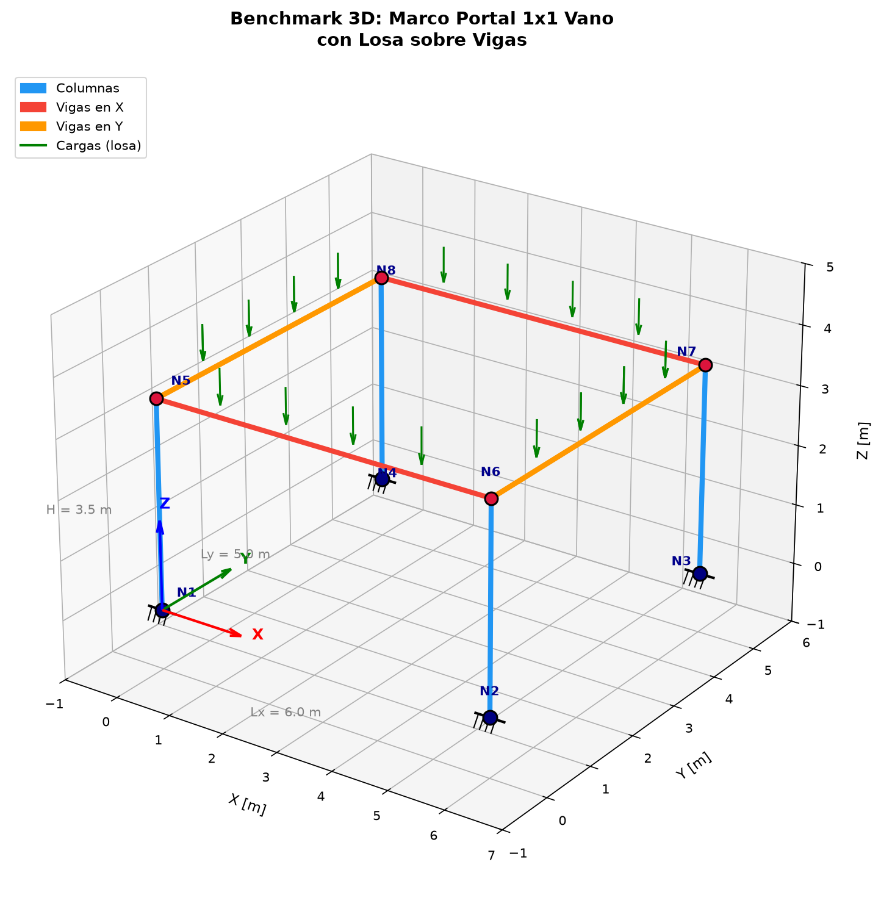
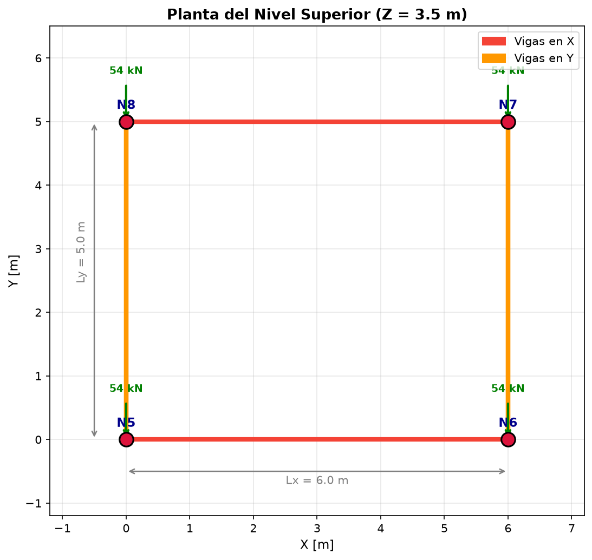

# Benchmark 3D - Marco Portal 1x1 Vano con Losa

## Descripcion del problema

Modelo estructural 3D de un marco portal de un solo vano en cada direccion (X e Y), con una losa de concreto que descarga sobre las vigas perimetrales e interiores.

### Geometria



| Parametro | Valor |
|-----------|-------|
| Vano en X | 6.0 m |
| Vano en Y | 5.0 m |
| Altura del piso | 3.5 m |
| Espesor de losa | 0.15 m |

### Planta del nivel superior



---

## Nodos y coordenadas

| Nodo | X [m] | Y [m] | Z [m] | Tipo |
|------|-------|-------|-------|------|
| 1 | 0.0 | 0.0 | 0.0 | Base (empotrado) |
| 2 | 6.0 | 0.0 | 0.0 | Base (empotrado) |
| 3 | 6.0 | 5.0 | 0.0 | Base (empotrado) |
| 4 | 0.0 | 5.0 | 0.0 | Base (empotrado) |
| 5 | 0.0 | 0.0 | 3.5 | Nivel superior |
| 6 | 6.0 | 0.0 | 3.5 | Nivel superior |
| 7 | 6.0 | 5.0 | 3.5 | Nivel superior |
| 8 | 0.0 | 5.0 | 3.5 | Nivel superior |

---

## Secciones y materiales

### Materiales

| Material | E [kN/m^2] | G [kN/m^2] | gamma [kN/m^3] |
|----------|-------------|-------------|-----------------|
| Concreto (columnas) | 25,000,000 | 10,416,667 | 24.0 |
| Acero (vigas) | 200,000,000 | 76,923,077 | - |

### Secciones

| Seccion | Dimensiones | A [m^2] | Iy [m^4] | Iz [m^4] | J [m^4] |
|---------|-------------|---------|----------|----------|---------|
| Columna | 0.35 x 0.35 m | 0.1225 | 0.001251 | 0.001251 | 0.000671 |
| Viga en X | 0.25 x 0.50 m | 0.1250 | 0.002604 | 0.000651 | 0.000438 |
| Viga en Y | 0.25 x 0.50 m | 0.1250 | 0.002604 | 0.000651 | 0.000438 |

---

## Condiciones de borde

- **Nodos 1, 2, 3, 4:** Empotrados (6 GDL fijos: Ux, Uy, Uz, RotX, RotY, RotZ)

---

## Elementos

| Elemento | Tipo | Nodo I | Nodo J | Seccion | Material |
|----------|------|--------|--------|---------|----------|
| 1 | Columna | 1 | 5 | 0.35x0.35 | Concreto |
| 2 | Columna | 2 | 6 | 0.35x0.35 | Concreto |
| 3 | Columna | 3 | 7 | 0.35x0.35 | Concreto |
| 4 | Columna | 4 | 8 | 0.35x0.35 | Concreto |
| 5 | Viga X | 5 | 6 | 0.25x0.50 | Acero |
| 6 | Viga X | 7 | 8 | 0.25x0.50 | Acero |
| 7 | Viga Y | 6 | 7 | 0.25x0.50 | Acero |
| 8 | Viga Y | 8 | 5 | 0.25x0.50 | Acero |

---

## Cargas

### Distribucion de la losa sobre vigas

La losa de 0.15 m de espesor (3.6 kN/m^2) descarga sobre las vigas segun areas tributarias:

| Viga | Direccion | Largo [m] | Area tributaria [m] | w [kN/m] |
|------|-----------|-----------|---------------------|----------|
| Vigas en X | Corto (Y=5m) | 6.0 | Ly/2 = 2.5 | 9.0 |
| Vigas en Y | Largo (X=6m) | 5.0 | Lx/2 = 3.0 | 10.8 |

### Cargas nodales equivalentes

| Nodo | Viga X [kN] | Viga Y [kN] | Total [kN] |
|------|-------------|-------------|------------|
| 5 | 27.0 | 27.0 | 54.0 |
| 6 | 27.0 | 27.0 | 54.0 |
| 7 | 27.0 | 27.0 | 54.0 |
| 8 | 27.0 | 27.0 | 54.0 |
| **Total** | | | **216.0 kN** |

---

## Resultados

### Desplazamientos (nivel superior)

| Nodo | Ux [m] | Uy [m] | Uz [m] | RotX [rad] | RotY [rad] | RotZ [rad] |
|------|--------|--------|--------|------------|------------|------------|
| 5 | ≈ 0 | ≈ 0 | -6.17e-05 | ≈ 0 | ≈ 0 | ≈ 0 |
| 6 | ≈ 0 | ≈ 0 | -6.17e-05 | ≈ 0 | ≈ 0 | ≈ 0 |
| 7 | ≈ 0 | ≈ 0 | -6.17e-05 | ≈ 0 | ≈ 0 | ≈ 0 |
| 8 | ≈ 0 | ≈ 0 | -6.17e-05 | ≈ 0 | ≈ 0 | ≈ 0 |

**Desplazamiento vertical promedio:** -0.0617 mm

### Reacciones en los apoyos

| Nodo | Rx [kN] | Ry [kN] | Rz [kN] | Mx [kN*m] | My [kN*m] | Mz [kN*m] |
|------|---------|---------|---------|-----------|-----------|-----------|
| 1 | ≈ 0 | ≈ 0 | 54.00 | 0.00 | 0.00 | 0.00 |
| 2 | ≈ 0 | ≈ 0 | 54.00 | 0.00 | 0.00 | 0.00 |
| 3 | ≈ 0 | ≈ 0 | 54.00 | 0.00 | 0.00 | 0.00 |
| 4 | ≈ 0 | ≈ 0 | 54.00 | 0.00 | 0.00 | 0.00 |
| **Suma** | **0.00** | **0.00** | **216.00** | **0.00** | **0.00** | **0.00** |

### Fuerzas en columnas

| Elemento | Extremo I Vz [kN] | Extremo J Vz [kN] |
|----------|-------------------|-------------------|
| Col 1 (1-5) | 54.00 | -54.00 |
| Col 2 (2-6) | 54.00 | -54.00 |
| Col 3 (3-7) | 54.00 | -54.00 |
| Col 4 (4-8) | 54.00 | -54.00 |

---

## Verificacion

Ver archivo [verificacion.md](verificacion.md) para el detalle completo de verificaciones.

| Verificacion | Estado |
|--------------|--------|
| Suma cargas = Suma reacciones | OK |
| Desplazamiento Uz vs referencia | OK |
| Reacciones por nodo | OK |
| Momentos en base (simetria) | OK |

---

## Glosario de 6 GDL por nodo

Cada nodo en un modelo 3D tiene 6 grados de libertad:

| GDL | Symbol | Descripcion |
|-----|--------|-------------|
| 1 | Ux | Desplazamiento en X |
| 2 | Uy | Desplazamiento en Y |
| 3 | Uz | Desplazamiento en Z (vertical) |
| 4 | RotX | Rotacion alrededor de X |
| 5 | RotY | Rotacion alrededor de Y |
| 6 | RotZ | Rotacion alrededor de Z |

---

## Transformaciones geometricas (geomTransf)

Las transformaciones geometricas definen la orientacion del eje local de cada elemento en el espacio global.

| Tag | Elementos | VecUz (orientacion) | Descripcion |
|-----|-----------|---------------------|-------------|
| 1 | Columnas | (0, -1, 0) | Eje Y local apunta en -Y global |
| 2 | Vigas en X | (0, 0, 1) | Eje Y local apunta en +Z global |
| 3 | Vigas en Y | (1, 0, 0) | Eje Y local apunta en +X global |

### Diferencia local/global

- **Global:** Sistema de coordenadas del modelo (X, Y, Z fijos)
- **Local:** Sistema de coordenadas de cada elemento (eje axial + ejes de seccion)

Las fuerzas y desplazamientos se reportan en el sistema LOCAL del elemento.

---

## Que resuelve OpenSees

OpenSees resuelve el sistema de ecuaciones de equilibrio:

```
[K] * {U} = {F}
```

Donde:
- **[K]** = Matriz de rigidez global del sistema (ensamblada a partir de los elementos)
- **{U}** = Vector de desplazamientos nodales (incognitas)
- **{F}** = Vector de fuerzas nodales (cargas aplicadas)

Para el caso estatico lineal, es una inversion directa de la matriz.

---

## Por que converger no significa estar correcto

1. **Convergencia numerica:** El solver encuentra una solucion que satisface el equilibrio dentro de una tolerancia, pero eso no garantiza que el modelo este correctamente definido.

2. **Errores posibles:**
   - Nodos en ubicaciones incorrectas
   - Elementos mal conectados
   - Propiedades de materiales incorrectas
   - Condiciones de borde inadecuadas
   - Cargas aplicadas en direccion incorrecta

3. **Siempre verificar:**
   - Equilibrio (suma de cargas = suma de reacciones)
   - Sentido de los resultados (desplazamientos, fuerzas)
   - Comparar con valores de referencia o estimaciones manuales

---

## Ejecucion

```bash
# Ejecutar el modelo
python benchmark_3d.py

# Generar visualizaciones 3D
python visualizar_3d.py
```

## Archivos

| Archivo | Descripcion |
|---------|-------------|
| `benchmark_3d.py` | Script principal del modelo 3D |
| `visualizar_3d.py` | Generacion de imagenes 3D |
| `verificacion.md` | Verificacion con valores de referencia |
| `resultados.json` | Resultados en formato JSON |
| `benchmark_3d_vista.png` | Vista isometrica 3D |
| `benchmark_3d_planta.png` | Vista en planta |
