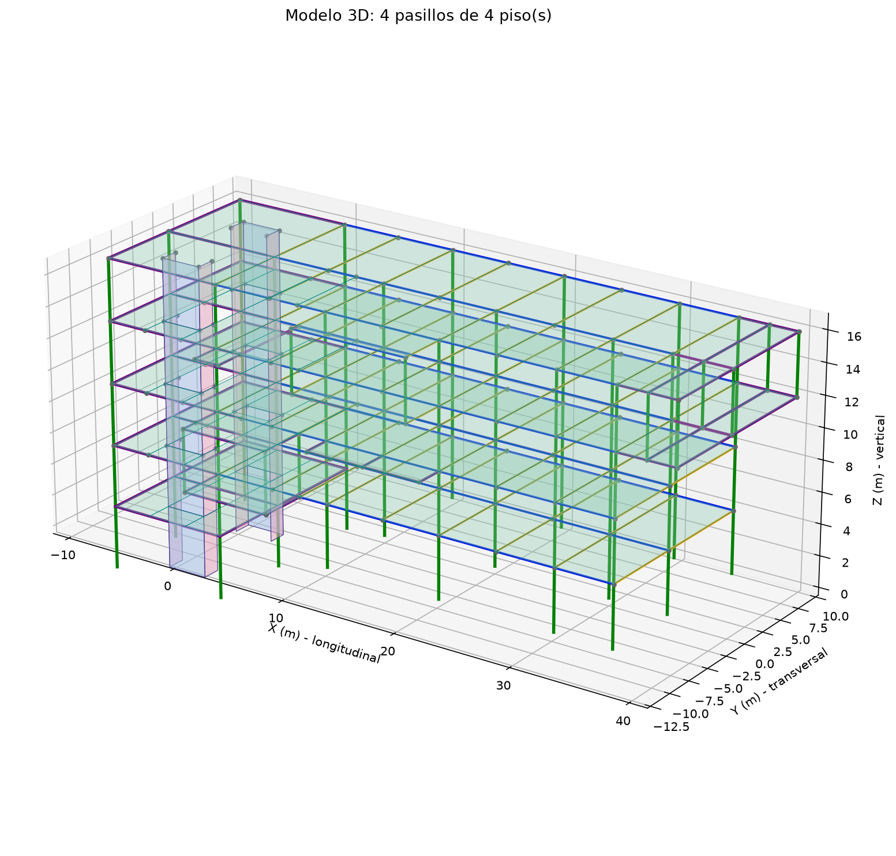
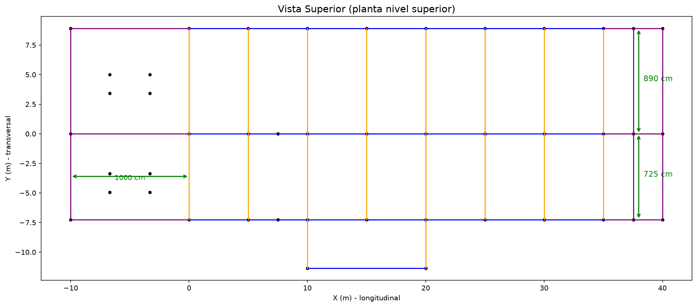
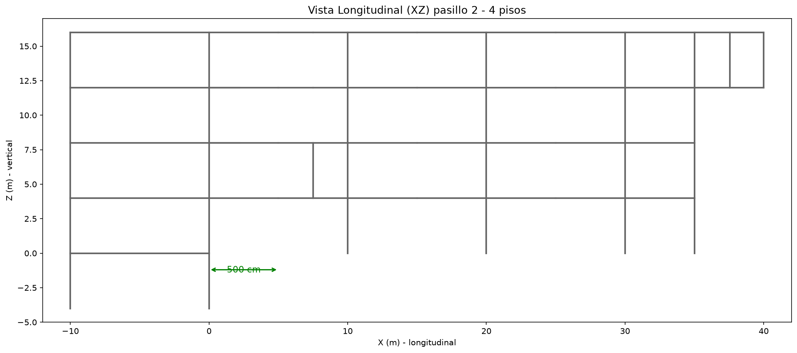

# Modelo Estructural 3D - Dos Pasillos (Vigas + Columnas)

Genera la geometría tridimensional de **dos pasillos paralelos** formados por vigas, columnas, **muros estructurales** y **losas de piso**, en **varios pisos**, lista para exportarse a **OpenSees/OpenSeesPy**. Incluye **apoyos empotrados** en las columnas más bajas (sótano y planta baja), cargas muertas, cargas vivas y una combinación última.

**Sistema de coordenadas (metros en OpenSees):**
- **X**: longitudinal de los pasillos
- **Y**: transversal
- **Z**: vertical

## Parámetros

| Parámetro | Valor |
|-----------|-------|
| Ancho pasillo 1 (transversal) | 890 cm = 8.90 m |
| Separación transversal pasillo 2 | 725 cm = 7.25 m |
| Separación longitudinal estándar | 500 cm = 5.00 m |
| Espacios longitudinales | 7 (8 líneas) |
| Altura por piso | 400 cm = 4.00 m |
| Número de pisos | 4 (configurable) |
| Niveles de viga | Z = 4, 8, 12 y 16 m |
| Sección columnas | 70 × 70 cm |
| Sección vigas | 60 × 80 cm |
| Material | E = 23500 MPa, ν = 0.2 |
| Carga muerta de losa | 3.75 kN/m² de peso propio + 1.00 kN/m² adicional = 4.75 kN/m² |
| Carga viva | 2.00 kN/m² |
| Combinación última | 1.2D + 1.6L |
| Muros estructurales | `MUROS_ESTRUCTURALES=True`; `MURO_YPOS="AMBOS"` (negativo + positivo) |
| Voladizo X+ (3er piso) | 255 cm → pilares (X=37.55) + 245 cm → pilares (X=40.00) |
| Pisos con voladizo X+ | 3 |

## Geometría

- **Pasillo 1**: de Y=0 a Y=+8.90, con vigas transversales (paralelas a Y) cada 500 cm y vigas longitudinales conectando columnas.
- **Pasillo 2 (espejo)**: reutiliza la línea compartida Y=0, con columnas en Y=-7.25, misma modulación.
- **Modificación especial (pasillo 2)**: se elimina la 2ª columna del lado nuevo (X=5.00 m) y se agrega una columna extra a 251 cm, en **X=7.51 m**, entre la 2ª y 3ª columna (X=5 y X=10). Además se mantiene una viga transversal en X=5 conectando la línea compartida (Y=0) con un nodo intermedio a nivel de viga sobre la longitudinal del pasillo 2. El 1er pasillo queda sin cambios.
- **Extensión exterior (voladizo 412 cm)**: desde las columnas X=0 y X=7.51 del lado nuevo del pasillo 2 salen vigas en voladizo de **412 cm (4.12 m)** hacia el exterior, cada una sostenida por una columna nueva en (0, -11.37) y (7.51, -11.37), que se conectan entre sí mediante una viga longitudinal en la punta.
- **Extensión hacia X negativo (1000 cm)**: se agrega una extensión de **10 m** hacia X negativo sobre las 3 líneas de columnas (Y=+8.90, Y=0, Y=-7.25), con **3 columnas en el extremo X=-10**, conectadas al resto con vigas longitudinales de 10 m y entre sí con vigas transversales en X=-10.
- **Múltiples pisos**: el modelo se construye en `N_PISOS` niveles. Cada piso tiene su nivel de vigas (`Z_VIGAS = [4, 8, 12]`) con **toda** la geometría plana de vigas repetida en cada nivel, y columnas que van de un nivel al siguiente. La geometría plana (incluyendo columna extra X=7.51, nodo intermedio X=5, voladizo y extensión X) se genera una sola vez y se replica verticalmente.
- **Voladizo eliminado en el 3er piso**: en el piso 3 (nivel Z=12) se eliminan las columnas y vigas del **voladizo (Y=-11.37)**. Parámetro `VOLADIZO_ELIMINAR_PISOS = [3]`; las columnas voladizas de ese tramo ya no existen, y las vigas `voladizo`/`extension` de ese nivel no se generan.
- **Voladizo en X positivo (3er piso)**: hacia el exterior en X+ (más allá del último pilar X=35) se avanza **255 cm** y se colocan **pilares de 4 m** (1 piso, Z=8→12) en **las 3 líneas** (ambos pasillos Y=+8.90 y Y=-7.25 más el eje central Y=0) en X=37.55; desde esos pilares se avanza **otros 245 cm** y se colocan **otros pilares** en las 3 líneas en X=40.00. Todo se une con **vigas longitudinales** (cada línea: 35→37.55→40.00) y **vigas transversales** en X=37.55 y X=40.00 que conectan las 3 líneas, **tanto a nivel superior (Z=12) como a nivel de piso (Z=8)**. Parámetros: `VOLADIZO_XP_PISOS = [3]`, `XD_XP_CM = 255`, `XD_XP_CM2 = 245`.
- **Voladizo Y-negativo del pasillo 2 (3er piso)**: en el pilar X=0 del pasillo 2 (Y=-7.25) se genera un **marco en voladizo** (sin pilares de apoyo) que sale **261 cm hacia Y negativa** (hasta Y=-9.86) con **ancho de 220 cm** hacia X positivo (de X=0 a X=2.20), en el 3er piso (Z=8→12), cerrado con vigas superior (Z=12) e inferior (Z=8). Además, en **X=2.20** solo a **nivel de techo (Z=12)** se genera una **viga hacia adentro del pasillo 2** que une la línea del pasillo (Y=-7.25) con la línea central (Y=0). En el **nivel inferior (Z=8)** se eliminan el **borde exterior longitudinal (Y=-9.86, X=0→2.20)** y la **transversal en X=2.20** (Y=-7.25→-9.86): `VOLADIZO_YP2_ELIMINAR_INFERIOR = True`. Parámetros: `VOLADIZO_YP2_PISOS = [3]`, `VD_YP2_PROF_CM = 261`, `VD_YP2_ANCHO_CM = 220`.

- **Eliminación en el 3er piso (pasillo 2)**: en el piso 3 (nivel Z=12) se elimina la **3ª columna del pasillo 2** (contando la de X negativo como 1ª), es decir la de **X=7.51 m**, junto con la **viga transversal hacia el pasillo 1** (transv_p2) en esa columna (de Y=-7.25 a Y=0). Los pisos 1 y 2 conservan esa columna y viga. Parámetros: `PISO3_ELIMINAR_BARRAS_P2 = True`, `ELIM_P2_COL_X_M = 7.51`.

- **Voladizo Y-negativo del pasillo 2 entre X=10 y X=20 (pisos 3 y 4)**: marco rectangular apoyado sobre el pasillo 2 que sale **412 cm hacia Y negativa** (de Y=-7.25 hasta Y=-11.37) entre **X=10 y X=20**, en los **pisos 3 (Z=8→12) y 4 (Z=12→16)**, con **2 columnas** en las esquinas exteriores (X=10, Y=-11.37 y X=20, Y=-11.37) de Z=8 a Z=16. El marco se cierra con vigas en los niveles únicos Z=8, Z=12 y Z=16 (el nivel compartido Z=12 no se duplica): una **viga longitudinal** en el borde exterior (X=10→20) y dos **vigas transversales** (en X=10 y X=20) que unen el pasillo 2 con el borde exterior. No hay elementos en Z=4. Parámetros: `VOLADIZO_YP2_FRAME_PISOS = [3, 4]`, `VD_YP2_FRAME_X1 = 10.0`, `VD_YP2_FRAME_X2 = 20.0`.

- **Piso 4 (solo 2 pasillos + voladizo X+ + extensión X negativa)**: con `N_PISOS = 4`, el cuarto piso (Z=12→16) se genera con `PISO4_SOLO_PASILLOS = True`, de modo que **sube los 2 pasillos** (pasillo 1, pasillo 2 y línea central con sus columnas y vigas), el **voladizo en el eje X** (`VOLADIZO_XP_PISOS = [3, 4]`) **y el tramo/extensión hacia X negativo** (`extension_x`, con sus 3 columnas en X=-10). Se excluyen del piso 4 únicamente el **voladizo Y- original** (`PISO4_EXCLUIR_PLANOS = {"voladizo", "extension"}` y columnas en Y=-11.37 de X=0/7.51), **conservándose el voladizo Y- de X=10→20** (`voladizo_yp2_frame`). Las columnas de las 3 líneas principales quedan en **X=-10, 0, 10, 20, 30, 35** más el voladizo X+ (X=37.55 y X=40); se eliminan X=5, 15, 25 en Y=8.90 y Y=0, y **X=7.51, 15, 25 en Y=-7.25** (la columna X=7.51 ya no se conserva). Las **vigas transversales del pasillo 2** en el nivel Z=16 quedan en **X=-10, 0, 10, 20, 30, 35, 37.55 y 40** (`PISO4_ELIMINAR_TRANSV_P2_7_51 = True`).

- **Piso 1 (columnas en X=-10,0,10,20,30,35)**: las columnas del 1er piso (Z=0→4) en las 3 líneas (Y=8.90, Y=0, Y=-7.25) quedan solo en **X=-10, 0, 10, 20, 30, 35**. Se eliminan las columnas de **X=5, 15, 25** en Y=8.90 y Y=0, las de **X=7.51, 15, 25** en Y=-7.25, y las columnas del voladizo en **Y=-11.37 (X=0 y X=7.51)** (definido en `piso1_cols_eliminar` dentro de `construir_modelo`). Las vigas de esos tramos se conservan.

- **Piso 2 (columnas según lado de Y)**: las columnas del 2º piso (Z=4→8) quedan en **Y=0 y el lado Y positivo (Y=8.90) en X=-10, 0, 10, 20, 30, 35** (se eliminan X=5, 15, 25), y en **el lado Y negativo (Y=-7.25) en X=-10, 0, 7.51, 10, 20, 30, 35** (se eliminan X=15, 25, **conservando la columna extra X=7.51**). El **voladizo Y=-11.37 del piso 2 no se modifica**. Definido en `piso2_cols_eliminar` dentro de `construir_modelo`.

- **Piso 3 (mismas columnas en las 3 líneas de Y)**: las columnas del 3er piso (Z=8→12) quedan en **las mismas X en las 3 líneas** (Y=8.90, Y=0, Y=-7.25): **X=-10, 0, 10, 20, 30, 35**. Se eliminan X=5, 15, 25 en Y=8.90 y Y=0, y X=15, 25 en Y=-7.25 (la X=7.51 y la X=5 de ese lado ya se eliminan por otras reglas del piso 3). Definido en `piso3_cols_eliminar` dentro de `construir_modelo`.

- **Piso 4 (mismas columnas + voladizos conservados)**: las columnas del 4º piso (Z=12→16) quedan en **las mismas X en las 3 líneas** (Y=8.90, Y=0, Y=-7.25): **X=-10, 0, 10, 20, 30, 35**, **conservando los voladizos**: el **voladizo X+** (X=37.55 y X=40) y el **voladizo Y-** (`voladizo_yp2_frame`, Y=-11.37, X=10 y 20). Se eliminan X=5, 15, 25 en Y=8.90 y Y=0, y X=7.51, 15, 25 en Y=-7.25. Definido en `piso4_cols_eliminar` dentro de `construir_modelo`.

- **Eliminación de voladizos en el piso 3 (`ELIMINAR_VOLADIZOS_PISO3 = True`)**: se retiran del piso 3 (Z=8→12) **solo las columnas** y las **vigas del nivel inferior Z=8** de dos voladizos: el **voladizo X+** (`voladizo_xpos`, pilares en X=37.55 y X=40) y el **marco Y-** (`voladizo_yp2_frame`, X=10→20). Así, esos voladizos pasan a existir **solo a partir del piso 4** (columnas Z=12→16, vigas en Z=12 y Z=16), que se conserva intacto. No se toca el módulo en X=0 (`voladizo_yp2`).

- **Subterráneo (Z=-4 a Z=0)**: con `SUBTERRANEO = True` se replica bajo el suelo la **parte de X negativo** (`extension_x`): bajan hasta **Z=-4** las columnas de las **3 líneas Y** en **X=-10** y, con `SUBTERRANEO_COLS_X0 = True`, también las de **X=0** (los pisos de arriba se mantienen intactos). En el techo del subterráneo (Z=0) se replican las **vigas de la extensión X negativa**: 3 longitudinales (X=0→X=-10 en las 3 líneas) y las transversales de cierre en X=-10 y X=0 (2 cada una). No hay vigas en Z=-4. Parámetros: `SUBTERRANEO = True`, `SUBTERRANEO_ALTURA_CM = 400`, `SUBTERRANEO_COLS_X0 = True`.

- **Muros estructurales (`MUROS_ESTRUCTURALES = True`)**: se añaden muros de cortante verticales de altura completa (Z=-4 a Z=16) que conectan los dos pasillos a la altura de la línea central modificada. La posición en Y se elige con `MURO_YPOS`, que controla **cuántos muros** se generan:
  - **`MURO_YPOS = "AMBOS"` (por defecto)**: genera los **dos** muros a la vez (negativo + positivo), uno en cada lado.
  - **`MURO_YPOS = "NEG"` (lado negativo)**: el **muro principal** (`muro_ppal`) está en el plano X-Z a **Y=-4.945** m, de **X=-6.7 a X=-3.3** m, espesor **t=0.20 m** (5 paneles de 4.0 m). Los **muros extremos** (`muro_ext`), en X=-3.3 y X=-6.7, van de **Y=-4.945 a Y=-3.37** (ancho transversal **1.575 m**), espesor **t=0.25 m** (10 paneles).
  - **`MURO_YPOS = "POS"` (lado positivo)**: espejo del negativo con las **mismas dimensiones**: el principal está a **Y=+5.00** y los extremos van de **Y=+5.00 a Y=+3.425** (ancho transversal 1.575 m), apuntando hacia Y=0 **sin llegar**, espesor **t=0.25 m** (10 paneles).
  - **Exportación**: los paneles se guardan en `resultados/muros.json` (definidos por sus 4 nodos esquina y el espesor) y se visualizan como superficies translúcidas en `modelo_3d.html` (casilla "Muros estructurales"). Con `"AMBOS"` hay **30 paneles** (10 `muro_ppal` + 20 `muro_ext`).
  - **En OpenSees**: este OpenSeesPy **no soporta elementos cascarón** (ni ShellMITC4 ni placas), por lo que los muros se modelan como **vigas equivalentes (frame)**: por cada banda se crean una **viga horizontal al tope** y **dos columnas de borde verticales**, con la **sección real del muro** (espesor × longitud en planta). Los tags de estos elementos equivalentes usan la base `500000+` para no chocar con las vigas/columnas normales.

- **Losas de piso (`LOSAS = True`)**: se generan losas (diafragmas) en cada **nivel de viga** (Z=4, 8, 12, 16) y en el **techo del subterráneo (Z=0)**, rellenando cada **bahía de la cuadrícula de vigas** entre los **3 ejes Y principales** (P1=8.90, COMP=0, P2=-7.25) y los **2 vanos transversales**. La cuadrícula se **subdivide en todas las líneas de viga** (aunque no haya columna: X=5, 15, 25, y la columna extra X=7.51 donde exista). Cada bahía queda definida por sus **4 nodos esquina**, su **nivel Z** y su **espesor** (`LOSA_ESPESOR_M = 0.15 m`).
  - **Voladizos con losa**: las superficies planas de todos los **voladizos** también reciben losa: el **voladizo X⁺** (X=35→40, franja que abarca las 3 líneas Y, en Z=12 y 16, subdividido en X=37.55), el **voladizo Y⁻ original** (X=0→7.51 hacia Y=-11.37, en Z=4 y 8), el **marco Y⁻ X=10→20** (hacia Y=-11.37, en Z=12 y 16), el **voladizo Y⁻ del pasillo 2** (X=0→2.2 hacia Y=-9.86, Z=12) y el **voladizo Y⁻ X=10→20 a Y=-9.71** (Z=8, subdividido en X=15).
  - **Huecos en la zona X negativa (huella de los muros, Z=0→12)**: en la bahía de losa **X=-10→0** se abre un **hueco (abertura interior sin losa)** coincidente con el **rectángulo envolvente de cada muro estructural**, desde el **subterráneo (Z=0) hasta el piso 3 (Z=12)**; en **Z=16 (piso 4)** la losa es completa. El resto de la bahía (a ambos lados en X y fuera del rectángulo en Y) conserva la losa. El hueco es la porción `X=-6.7→-3.3` (muro principal `muro_ppal`) más su extensión transversal, subdividida en los bordes con **nodos auxiliares**:
    - **Lado negativo (COMP→P2)**: el hueco es el rectángulo **X=-6.7→-3.3 × Y=-4.95→0** (la huella del muro NEG llega **hasta Y=0**). La losa queda en Y=-7.25→-4.95 de esa franja X y fuera de la franja X en ambos lados.
    - **Lado positivo (P1→COMP)**: el hueco es el rectángulo **X=-6.7→-3.3 × Y=3.425→5.0** (envelope del muro POS). La losa queda en Y=0→3.425 y Y=5.0→8.9 de esa franja X y fuera de la franja X en ambos lados.
  - **Exportación**: los paneles se guardan en `resultados/losas.json` (4 nodos esquina + nivel + espesor + detalle) y se visualizan como superficies translúcidas horizontales en `modelo_3d.html` (casillas "Losas de piso" y "Zona de muro").
- **En OpenSees**: losas representadas como **diafragmas rígidos por piso**: `ops.rigidDiaphragm` con un **nodo maestro** por nivel y los nodos de ese nivel como esclavos del plano (ux, uy, rz).

- **Cargas gravitacionales**: cada panel de losa distribuye uniformemente su carga entre sus 4 nodos esquina. Se crean tres patrones OpenSees independientes: **D** (muerta), **L** (viva) y **COMB** (`1.2D + 1.6L`), con fuerzas verticales negativas en Z. Los valores son parámetros editables en `modelo_pasillos.py`: `CARGA_MUERTA_ADICIONAL`, `CARGA_VIVA`, `FACTOR_COMB_D` y `FACTOR_COMB_L`.

- **Apoyos empotrados**: las columnas más bajas sin apoyo se **empotran** (6 DOF fijos, `ops.fix`):
  - **Subterráneo**: base en **Z=-4** de las columnas del sótano (X=-10 y X=0, en las **3 líneas Y**) → **6 nodos**.
  - **Planta baja**: base en **Z=0** de las columnas del 1er piso que **no** arrancan del sótano (X=10, 20, 30, 35, en las **3 líneas Y**) → **12 nodos**.
  Total: **18 apoyos** (contabilizados automáticamente por criterios de coordenada).

## Resumen (4 pisos)

> En el 3er piso se elimina el voladizo (Y=-11.37) y la columna/viga de X=7.51.
> En el 4º piso (Z=12→16) solo suben los 2 pasillos, el voladizo en X+ (`voladizo_xpos`) y la extensión X negativa: no sube el voladizo Y-.

| Concepto | Cantidad |
|----------|----------|
| Nodos | 241 (incluye auxiliares de los bordes de hueco) |
| Columnas | 89 |
| Vigas longitudinales | 126 |
| Vigas transversales | 101 |
| Total elementos (vigas+col) | 317 |
| Muros estructurales (paneles) | 30 (10 muro_ppal + 20 muro_ext) — `MURO_YPOS="AMBOS"` |
| Muros principal (`muro_ppal`) | En Y=-4.945 y Y=+5.00, X=-6.7 a -3.3, t=0.20 m, Z=-4 a 16 |
| Muros extremos (`muro_ext`) | Negativo (X=-3.3/-6.7, Y=-4.945 a -3.37) y positivo (Y=+5.00 a +3.425), t=0.25 m |
| Columna eliminada | X = 5.00 m (2ª del pasillo 2) |
| Columna extra | X = 7.51 m (251 cm desde X=5) |
| Viga transversal extra | X = 5.00 m (sin columna en ese lado) |
| Vigas voladizo + columnas | 412 cm desde X=0 y X=7.51 (Y=-11.37) |
| Extensión X negativo | 1000 cm hacia X=-10 (3 columnas) |
| Voladizo X=10→20 (pisos 3 y 4) | 412 cm hacia Y=-11.37, 2 columnas (Z=8→16) |
| Piso 4 | 2 pasillos + voladizo X+ + extensión X negativa (conserva voladizo Y- X=10→20; sin el voladizo Y- original X=0/7.51) |
| Transv. pasillo 2 en piso 4 | En X=-10,0,10,20,30,35,37.55,40 (sin X=7.51; columna X=7.51 también eliminada) |
| Subterráneo | Z=-4→0, columnas en X=-10 y X=0 (3 líneas), vigas de techo Z=0 (parte X negativa) |
| Columnas piso 1 | Las 3 líneas en X=-10,0,10,20,30,35; sin voladizo Y=-11.37 |
| Columnas piso 2 | Y=0 y Y=8.90 en X=-10,0,10,20,30,35; Y=-7.25 en X=-10,0,7.51,10,20,30,35 (voladizo sin cambios) |
| Columnas piso 3 | Las 3 líneas (Y=8.90, Y=0, Y=-7.25) en X=-10,0,10,20,30,35 |
| Columnas piso 4 | Las 3 líneas en X=-10,0,10,20,30,35 + voladizo X+ (37.55/40) + voladizo Y- (Y=-11.37, X=10 y 20) |
| Voladizos piso 3 | Se eliminan columnas (Z=8→12) y vigas de Z=8: X+ (37.55/40) e Y- (X=10→20); viven solo en piso 4 |
| Losas de piso | 101 paneles (Z=0,4,8,12,16): huecos interiores en la huella de los muros (X=-6.7→-3.3; NEG hasta Y=0, POS Y=3.425→5) en Z=0→12; losa completa en Z=16 |
| Cargas | Patrones separados D, L y COMB = 1.2D + 1.6L; cargas nodales equivalentes de los paneles |
| Diafragmas rígidos | 5 niveles de losa (`ops.rigidDiaphragm`, nodo maestro + esclavos ux/uy/rz) |
| Apoyos empotrados | 18 nodos base (Z=-4: 6 del sótano; Z=0: 12 de planta baja) |

## Ejecución

```bash
python modelo_pasillos.py
python generar_html.py    # opcional: crea modelo_3d.html
```

Genera coordenadas de nodos, conectividad de elementos y las vistas 3D.

## Salidas

| Archivo | Contenido |
|---------|-----------|
| `coordenadas_nodos.json` | Tabla de coordenadas de todos los nodos |
| `elementos.json` | Tabla de conectividad de todos los elementos |
| `muros.json` | Paneles de muros estructurales (4 nodos esquina + espesor) |
| `losas.json` | Paneles de losa de piso (4 nodos esquina + nivel + espesor + detalle) |
| `cargas.json` | Supuestos, intensidades y cargas nodales de D, L y COMB |
| `modelo_3d.png` | Vista 3D del modelo completo |
| `vista_superior.png` | Planta (comprueba 890 y 725 cm) |
| `vista_longitudinal.png` | Perfil (comprueba 500 cm, 7 espacios y pisos) |
| `modelo_3d.html` | Visualizador 3D interactivo (Three.js) |

## Visualizador 3D (HTML)

Se genera un visualizador interactivo autocontenido (`resultados/modelo_3d.html`)
con Three.js a partir de las tablas JSON:

```bash
python generar_html.py
```

Abrir `modelo_3d.html` en el navegador (doble clic; necesita conexión para cargar
Three.js desde el CDN).

| Acción | Control |
|--------|---------|
| Rotar | Arrastrar (botón izquierdo) |
| Zoom | Rueda del ratón |
| Desplazar | Cambiar de perspectiva (botón der. / Shift) |
| Mostrar/ocultar | Casillas del panel (columnas, vigas, muros y losas) |

## Vistas







## Dependencias

- `openseespy`
- `numpy`
- `matplotlib`
