# Informe final — P1_G4: laboratorio estructural OpenSees + Unity + AR

**Grupo 4:** Matías Campos · Iván González · Mauricio Lenz
**Curso:** MCOC, Universidad de los Andes · semana 7, entrega final (8 de octubre de 2026)
**Repositorio:** `github.com/mauricio-lenz/P1_G4_Final` · las cifras salen de la corrida registrada en `reports/img/final/cifras_informe_final.json`
**Unidades:** kN, m, kN·m, rad

Para reproducir todo lo que aparece aquí, ver `README.md`. Las cifras y figuras de este informe se regeneran con `exportar_resultados_unity.py` y `figuras_informe_final.py`.

**Dónde está cada criterio de la rúbrica**

| Criterio (puntos) | Secciones |
|---|---|
| Modelo y verificación (4) | 2, 3, 8 |
| Cargas y superposición (3) | 4, 5, 6, 7 |
| Capacidad RC (3) | 9, 10, 11, 12 |
| Unity, interacción y modificación (3) | 13, 14, 15 |
| AR (2) | 16 |
| QA y reproducibilidad (2) | 18 y `README.md` |
| Informe y limitaciones (1) | 19 |
| Aprendizaje individual e IA (2) | 20, 21 |
| Honors | 22 |

---

## 1. Resumen

Modelamos en OpenSees los dos edificios de hormigón armado G35 de los planos del curso: el **edificio 1** (2017_67) y el **edificio 2** (2024_22). Están separados por una junta de dilatación. El modelo se construye y se corrige desde los planos DXF con scripts reproducibles, OpenSees resuelve los casos y combinaciones, y Python verifica la capacidad ACI 318-19 con la armadura leída de los planos. Unity muestra y modifica el modelo, puede pedir un reanálisis, y una app Android lo pone en realidad aumentada sobre la columna E1_243.

| Resultado | Valor |
|---|---|
| Modelo | 722 nodos · 1 023 elementos · 78 apoyos |
| Cargas | G = 75 700,9 kN · Q = 25 885,9 kN · corte basal NCh433 EX 9 174,5 kN y EY 6 639,8 kN |
| Verificación global | equilibrio con error ≤ 2·10⁻⁶ kN · superposición con error 2,4·10⁻⁹ · deriva máxima 1,63 ‰ (límite 2 ‰) |
| Armadura | 319 vigas y 81 muros con las barras de los planos; el resto y las columnas, con armadura tipo supuesta |
| Capacidad (C1 a C3, con torsión accidental) | vigas DCR ≤ 0,87 · columnas ≤ 0,83 · muros C ≤ 0,82: ningún elemento sobre 1 |
| Capacidad (NCh3171) | 39 vigas, 16 columnas y 20 muros sobre 1 (sensibilidad, sección 12) |
| QA | 55 tests automáticos y `qa_semana06.py`, todos en verde |

**Conclusión principal:** con las combinaciones del curso ningún elemento supera su capacidad; con las combinaciones de diseño de la NCh3171 sí. Parte de esa diferencia viene de la armadura supuesta y de la idealización de los muros, pero no la descartamos: el modelo es un laboratorio de análisis, no una verificación de diseño del edificio real.

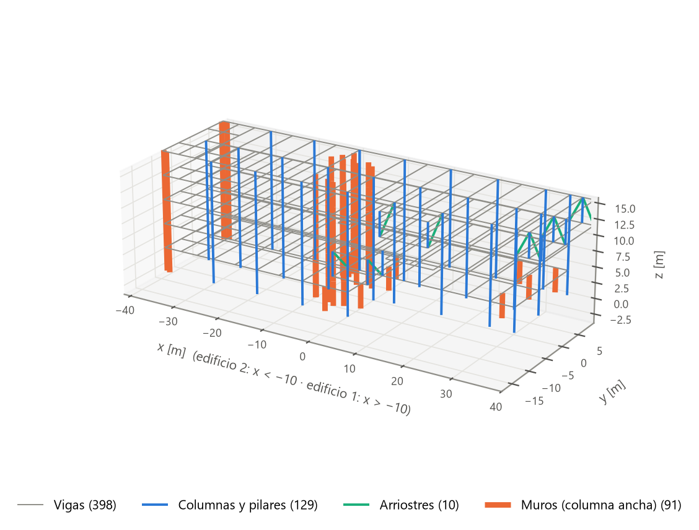

*Figura 1. Modelo analizado. Los muros se dibujan en su eje como columna ancha.*

---

## 2. Edificio e idealización

| | Edificio 1 (2017_67) | Edificio 2 (2024_22) |
|---|---|---|
| Planta | x −10 a 40 m · y −11,37 a 8,90 m | x −41,48 a −10 m · y −8,34 a 9,99 m |
| Sistema | marcos V60/80 y columnas 70×70, núcleo de muros entre E y F, pilares metálicos P.M. 300×300×20 y arriostres V.M. 300×300×5 en la zona I'-J | marcos V60/80, V40/80 y V30/80 con columnas 70×70, muros en los ejes A', C', D, 1, 1' y 3 |
| Elementos | 233 vigas · 89 columnas · 10 arriostres · 46 muros · 42 apoyos | 165 vigas · 40 columnas · 45 muros · 32 apoyos |

Ambos edificios tienen radier en z = −3,96 y cinco niveles de diafragma cada 3,96 m (CIELO_1S en z = 0 hasta la cubierta en z = 15,84). La **junta de dilatación** está en x = −10 m: ningún nodo pertenece a los dos edificios, y cada uno tiene sus diafragmas, su análisis modal y su coeficiente sísmico. Se resuelven en el mismo modelo, pero no interactúan.

**Idealización:**

- **Elementos:** `elasticBeamColumn` 3D. El análisis global es lineal; la no linealidad se estudia en las secciones (9 a 11).
- **Muros:** como **columna ancha**. Cada paño es una columna en su eje con la sección t × L del muro, unida al marco con brazos rígidos horizontales en cada piso (91 paños, 395 brazos).
- **Diafragmas:** rígidos (`rigidDiaphragm`), uno por edificio y piso.
- **Apoyos:** empotramientos en la cota de fundación; el suelo no se modela.
- **Rigidez:** fisurada según ACI 318-19 §6.6.3.1.1: vigas 0,35 I_g, columnas 0,70 I_g, muros 0,35 I_g.
- **Cargas:** las gravitacionales, como carga repartida en cada viga, para que OpenSees entregue los momentos de empotramiento; el sismo, en el **centro de masa** de cada diafragma (sección 6), con la torsión accidental de la NCh433.
- **Materiales** (nota general de los planos):
    - hormigón G35: f'c = 35 MPa, E = 4 700 √f'c = 27,8 GPa, ν = 0,2;
    - acero de refuerzo A630-420H: f_y = 420 MPa;
    - perfiles A36: f_y = 250 MPa, E = 200 GPa.

---

## 3. Geometría y datos

Todo el modelo sale de los DXF (carpeta `Planos_1_dxf`, fuera del repositorio por su tamaño) mediante tres scripts. Los JSON que generan sí están en el repositorio:

| Script | Qué hace |
|---|---|
| `ajustar_modelo_planos.py` | Aplica **16 ajustes** contrastados con plantas y elevaciones sobre el modelo base. Los más importantes: el edificio 2 venía **reflejado en Y**; faltaban 16 muros y los 21 elementos metálicos; **45 vigas** secundarias no compartían nodo con la viga en que se apoyan; el reparto tributario dejaba sin cargar unos 1 600 m² de losa |
| `generar_ejes_grilla.py` | Lee las burbujas de ejes de las plantas: 40 ejes, principales (A a J, 1 a 3) y secundarios (Ea, 2a, 1'', 1A', …) |
| `extraer_armaduras_planos.py` | Lee las 25 elevaciones de vigas y muros: 1 546 grupos de barras, las mallas y las barras de borde de cada muro |

**Lectura de la armadura.** Cada barra de una elevación es un bloque con cantidad, diámetro, largo y capa. Su posición en planta sale de la escala del dibujo (0,01 m/cm), anclada a las columnas dibujadas, porque algunas burbujas de eje se dibujan corridas (E y E'). El piso sale de la cota más cercana, y los pisos "IDEM" copian la armadura del piso indicado. Si la barra es superior o inferior se decide por su profundidad bajo la cara superior de cada viga: el atributo MINUS del plano está mal en unas 200 barras. En los muros se leen la malla (como bloque o como texto, por ejemplo "M.H.A. e=60 / 4.M. φ10a20") y las barras verticales de cada punta.

Resultado: **319 de 398 vigas** y **81 de 91 muros** tienen la armadura del plano. Los demás no aparecen en ninguna elevación y usan la armadura tipo de `data/armaduras.json`, marcada como supuesta.

---

## 4. Cargas gravitacionales y áreas tributarias

**Carga muerta:**

- **Losa y terminaciones en pisos:** q_G = 635 kgf/m² = 6,227 kN/m² (375 de losa de 0,15 m más 260 de terminaciones y tabiquería).
- **Cubierta:** 575 kgf/m² = 5,639 kN/m².
- **Peso propio:** con γ = 25 kN/m³ (78,5 kN/m³ en los perfiles). En las vigas se cuenta solo el alma bajo la losa, para no contar la losa dos veces.

**Áreas tributarias.** Cada panel de losa se reparte entre las vigas y muros que lo apoyan, con el polígono tributario de cada lado (trapecios y triángulos). La carga de cada viga es q · A / L, repartida; los muros reciben su parte por sus brazos rígidos. La suma de las áreas tributarias es igual al área de losa:

| Piso | E1: A [m²] | E1: D losa [kN] | E1: Q [kN] | E2: A [m²] | E2: D losa [kN] | E2: Q [kN] |
|---|---|---|---|---|---|---|
| CIELO_1S | 139,3 | 867,6 | 683,2 | 521,4 | 3 247,1 | 2 556,7 |
| CIELO_1 | 768,6 | 4 786,2 | 3 768,7 | 521,4 | 3 247,1 | 2 556,7 |
| CIELO_2 | 804,5 | 5 009,5 | 3 944,5 | 521,4 | 3 247,1 | 2 556,7 |
| CIELO_3 | 909,4 | 5 663,3 | 4 459,3 | 521,4 | 3 247,1 | 2 556,7 |
| CIELO_4 (cubierta) | 925,9 | 5 220,8 | 1 815,9 | 503,3 | 2 838,3 | 987,2 |
| **Total** | **3 547,7** | **21 547,4** | **14 671,6** | **2 588,9** | **15 826,7** | **11 214,0** |

**Caso G:** losa 37 374,0 kN + peso propio 38 326,9 kN = **75 700,9 kN**, igual a la suma de las reacciones con un error de 2,3·10⁻⁹ kN. El descenso máximo es 25,9 mm, en el edificio 2 (nodo 346), donde una viga V30/80 se apoya a media luz de una V60/80, sin columna.

---

## 5. Carga viva

Sobrecarga de 500 kgf/m² (4,903 kN/m²) en pisos y 200 kgf/m² (1,961 kN/m²) en la cubierta de cada edificio, que es una losa no accesible. Q usa las mismas áreas tributarias que G (tabla de la sección 4):

- **Conservación:** Q transferida a las vigas = Σ q · A = **25 885,86 kN** sobre 6 136,8 m², con error 0.
- **Equilibrio:** Σ reacciones del caso Q = 25 885,86 kN, con error de 4·10⁻⁹ kN.

---

## 6. Sismo pseudoestático

**Método:** análisis estático NCh433 con el DS61, por edificio y por dirección.

```text
C    = 2,75 · S · A0 / (g · R) · (T' / T*)^n,   acotado entre  Cmin = A0 · S / (6g)  y  Cmax = 0,35 · S · A0 / g
Q0   = C · I · P,                                con P = Σ (D + 0,25 Q)
F_k  = Q0 · A_k · P_k / Σ (A_j · P_j),           A_k = √(1 − Z_{k−1}/H) − √(1 − Z_k/H)
```

**Parámetros:**

- zona 3 (A0 = 0,40 g);
- suelo C (S = 1,05, T' = 0,45 s, n = 1,40);
- R = 7 e I = 1,0;
- H = 19,8 m, desde el radier.

T* es el período del modo con mayor masa traslacional en cada dirección, según el análisis modal de cada edificio con masa (D + 0,25 Q)/g. Los parámetros están en `data/parametros_analisis.json` y se pueden cambiar desde Unity.

**Punto de aplicación y torsión accidental.**

- **Centro de masa:** la fuerza de cada piso actúa en el centro de masa calculado con los pesos nodales D + 0,25Q. En el nodo maestro del diafragma se aplican la fuerza y el torsor equivalente M_z = r × F. Antes usábamos el centroide de los nodos, que en el edificio 1 quedaba 4,6 a 5,0 m al oeste del centro de masa real (10 % del largo de la planta).
- **Torsión accidental (NCh433 §6.2.8):** torsor M_z = F_k · (±0,10 · b_k · Z_k / H) en cada piso, con b_k la dimensión de la planta perpendicular al sismo. Se resuelve como dos casos de torsor puro, TX y TY. La verificación de capacidad prueba cada combinación con ±TX y ±TY y conserva, para cada elemento, el signo más desfavorable.

| Edificio | Modo | T [s] | UX | UY | P [kN] | Dir. | C sin límites | C usado | Q0 [kN] |
|---|---|---|---|---|---|---|---|---|---|
| 1 | 3 | 0,422 | **0,588** | 0,003 | 45 898 | X | 0,181 | **0,147 = Cmax** | 6 747,0 |
| 1 | 1 | 0,684 | 0,005 | **0,455** | 45 898 | Y | 0,092 | 0,092 | 4 212,3 |
| 2 | 1 | 0,856 | **0,381** | **0,260** | 34 678 | X e Y | 0,067 | **0,070 = Cmin** | 2 427,5 c/u |

**Modos acoplados del edificio 2.** Los modos 1 y 2 del edificio 2 son diagonales. Revisamos que no fuera un error del modelo:

- los muros coinciden con las elevaciones y su inercia fuerte está bien orientada;
- con 100 kN por piso, el techo se mueve 3,34 mm en X y 3,49 mm en Y, es decir, el edificio es casi igual de flexible en las dos direcciones;
- los muros Y rígidos están junto a la junta, a unos 15 m del centro de masa, y la torsión que eso produce acopla X e Y y gira los ejes principales hacia 45°.

No cambia el diseño: C queda en Cmin en ambas direcciones.

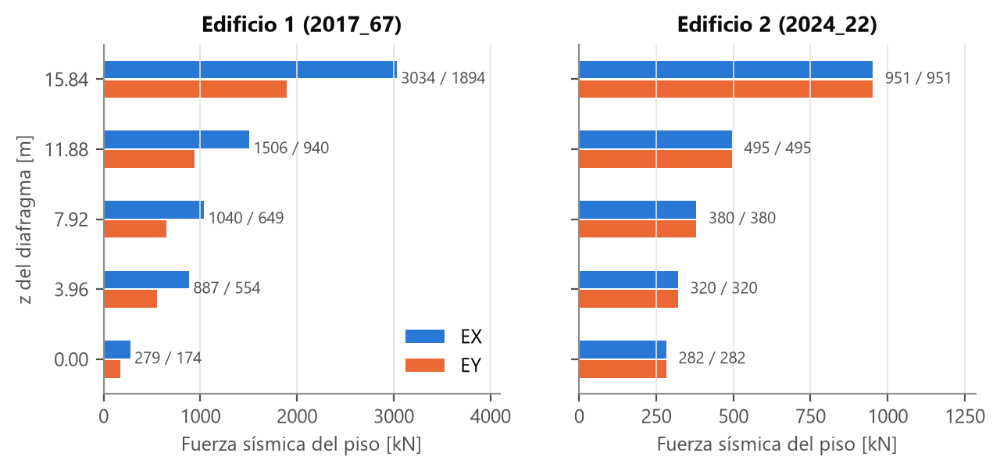

*Figura 2. Fuerza de cada piso (EX / EY) en el nodo maestro del diafragma.*

**Derivas (NCh433 §5.9):**

- **En el centro de masa:** máximo **1,63 ‰** (edificio 1, EY, CIELO_3), con límite de 2 ‰.
- **Exceso de un punto sobre el centro de masa:** máximo **0,60 ‰** (columna E1_294, extremo este del edificio 1, EY, CIELO_3), con límite de 1 ‰.

Ambas cumplen.

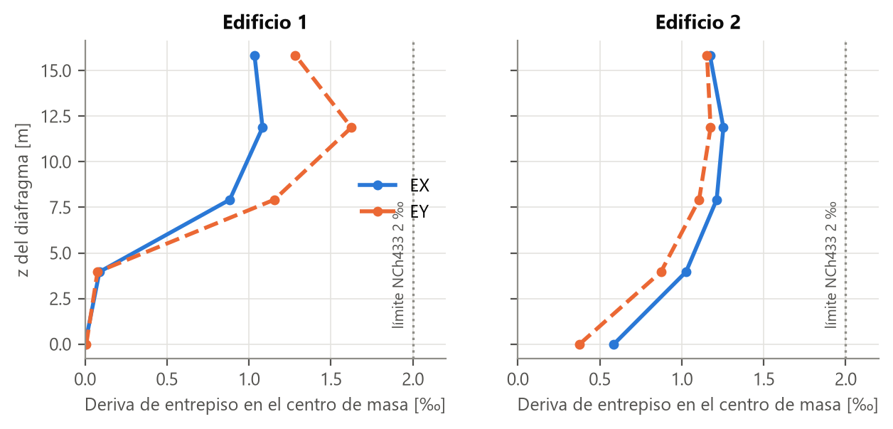

*Figura 3. Deriva de entrepiso en el nodo maestro de cada diafragma.*

---

## 7. Superposición

Las combinaciones están en `data/combinaciones.json` y las usan el análisis, el reanálisis y Unity:

- **C1** = G + 0,5Q + 0,3EX + 0,2EY;
- **C2** = G + 0,5Q + 0,3EX − 0,2EY;
- **C3** = G + 0,5Q − 0,3EX + 0,2EY.

Son las que usa el curso desde la semana 3. No son las combinaciones de diseño de la NCh3171, que llevan el sismo completo; esas se evalúan como sensibilidad en la sección 12.

Como el análisis es lineal, cada combinación resuelta directamente en OpenSees debe ser igual a la suma Σ λ · caso base. La diferencia máxima en desplazamientos, reacciones y fuerzas internas de los 1 023 elementos es **2,4·10⁻⁹**, con tolerancia 10⁻⁶. En Unity la superposición es interactiva (sección 14).

---

## 8. Análisis global y verificaciones

| Caso | Carga aplicada [kN] | Σ reacciones [kN] | Error [kN] |
|---|---|---|---|
| G | 75 700,94 | 75 700,94 | 2,3·10⁻⁹ |
| Q | 25 885,86 | 25 885,86 | −4,1·10⁻⁹ |
| EX | 9 174,48 | 9 174,48 | 1,9·10⁻⁶ |
| EY | 6 639,76 | 6 639,76 | 2,3·10⁻⁷ |

También se verifican automáticamente (sección 18):

- las unidades, con E y el peso propio calculados a mano;
- que los ejes locales sean ortonormales y que el eje x de columnas y muros sea vertical;
- que la junta no tenga nodos compartidos;
- un diafragma por edificio y piso;
- que el JSON que ven Unity y la AR sea igual a una corrida directa de OpenSees.

**Sensibilidad a la rigidez** (`sensibilidad_rigidez.py`, recalculando T* y C en cada escenario):

| Escenario | u máx EX / EY [mm] | Deriva máxima en cualquier columna o muro, EX / EY | Corte que toman los muros |
|---|---|---|---|
| Sección bruta | 17,9 / 21,9 | 1,09 ‰ / 1,77 ‰ | 95 % / 101 % |
| **Fisurada ACI (vigente)** | **20,9 / 26,1** | **1,26 ‰ / 2,22 ‰** | 97 % / 104 % |

La fisuración aumenta los desplazamientos cerca de 20 %. Los muros toman prácticamente todo el corte basal. La deriva de 2,22 ‰ es la de un punto, no la del centro de masa: el control de la norma es el de la sección 6.

---

## 9. Fiber Sections

La sección de fibras representa la columna tipo **COL70/70 con 8φ25** (ρ = 0,80 %):

| Componente | Modelo |
|---|---|
| Hormigón | f'c = 35 MPa, parábola de Hognestad hasta ε0 = 0,002, rama descendente hasta 0,85 f'c en ε_cu = 0,0035, sin tracción |
| Acero | bilineal f_y = 420 MPa, E_s = 200 GPa, endurecimiento 1 % |
| Malla | 20 × 20 fibras de hormigón + 8 barras |

Para cada curvatura φ se busca por bisección la deformación axial ε0 que equilibra la carga P, y se integra el momento con ε_i = ε0 + φ · y_i y M = Σ σ_i A_i y_i. La misma sección, con Concrete01 y Steel01 en OpenSees, da la curva P-M de fibras con que se compara la curva ACI (sección 11).

Los 8φ25 son **armadura supuesta**. Los planos no traen cuadro de pilares, y la cuantía de 0,80 % queda bajo el mínimo ACI de 1 % (§10.6.1.1), así que la columna real debería resistir más.

---

## 10. M-phi

La curva se calcula con P = 0 y se corta cuando la fibra más comprimida llega a ε_cu = 0,0035.

| Malla | M_max [kN·m] | φ en M_max [1/m] |
|---|---|---|
| 10 × 10 | 596,3 | 0,072 |
| **20 × 20 (vigente)** | **587,7** | **0,061** |
| 40 × 40 | 591,1 | 0,062 |

La malla vigente difiere 0,6 % de la de 40 × 40.

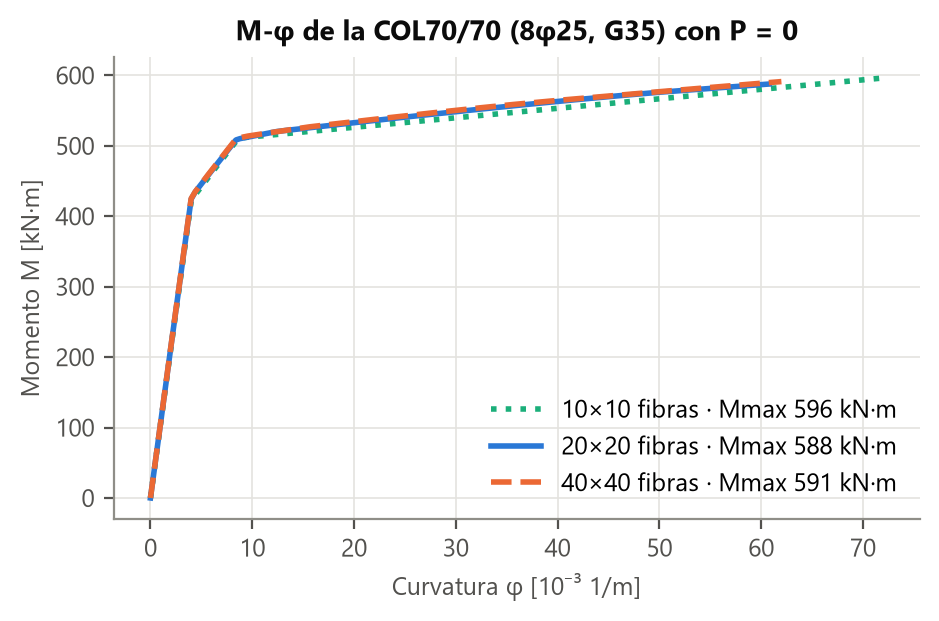

*Figura 4. M-φ de la COL70/70 con P = 0.*

La curva tiene dos quiebres:

1. **fluencia de la capa traccionada** (3φ25), con M_y ≈ 420 kN·m y φ_y ≈ 0,004 1/m;
2. **fluencia de las barras centrales**, cerca de 510 kN·m.

Después sigue casi plana hasta el aplastamiento. La ductilidad de curvatura es φ_u/φ_y ≈ 15.

---

## 11. P-M columna y muro

**Método (ACI 318-19).** `capacidad_ha.py` calcula la curva de diseño de cualquier sección rectangular con barras en posiciones conocidas, por compatibilidad de deformaciones:

- bloque de Whitney con β1 = 0,80 y ε_cu = 0,003;
- acero elastoplástico;
- φ entre 0,65 y 0,90 según ε_t de la barra extrema (§21.2.2);
- tope φP_max = 0,80 · φ · P0 (§22.4.2.1);
- tracción pura −0,9 · f_y · A_st.

**Columna COL70/70:**

- P0 = 16 110 kN y φP_max = 8 377 kN;
- φM_n = 460,7 kN·m con P = 0 (M_n = 511,9 kN·m);
- la curva de fibras da 520,7 kN·m con P = 0, un 2 % más que la nominal ACI.

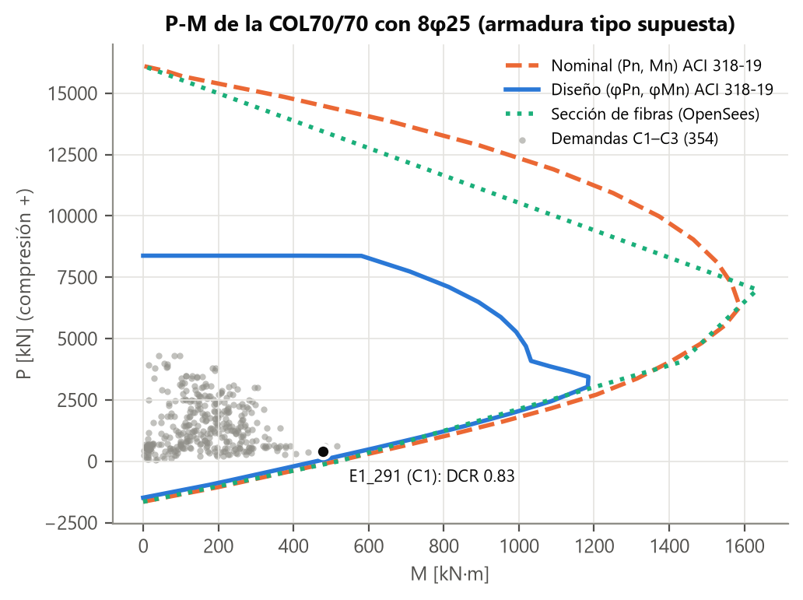

*Figura 5. P-M de la COL70/70 con las demandas de las 118 columnas en C1 a C3 (momento resultante √(M_y² + M_z²)).*

Los pilares metálicos usan la interacción AISC 360 H1-1, sin pandeo.

**Muros.** Cada muro tiene su propia curva de diseño en el plano, con su armadura del plano:

- **malla vertical:** n mallas φd @ s; doble malla son 2, y los muros de 60 cm del eje A' tienen 4;
- **barras de borde:** las que el plano dibuja en cada punta, en pares cada 10 cm desde el extremo;
- **esquinas:** como el muro del modelo termina en el eje y el dibujado sigue hasta la cara exterior de la esquina, se aceptan barras de borde hasta 45 cm por fuera del extremo, sin asignar ninguna a dos muros.

Los 10 muros sin elevación usan doble malla φ12 @ 20 supuesta. Antes las curvas de muro se escalaban de un muro de referencia con la misma cuantía para todos; con la armadura real, los 5 muros que daban C > 1 dejaron de hacerlo.

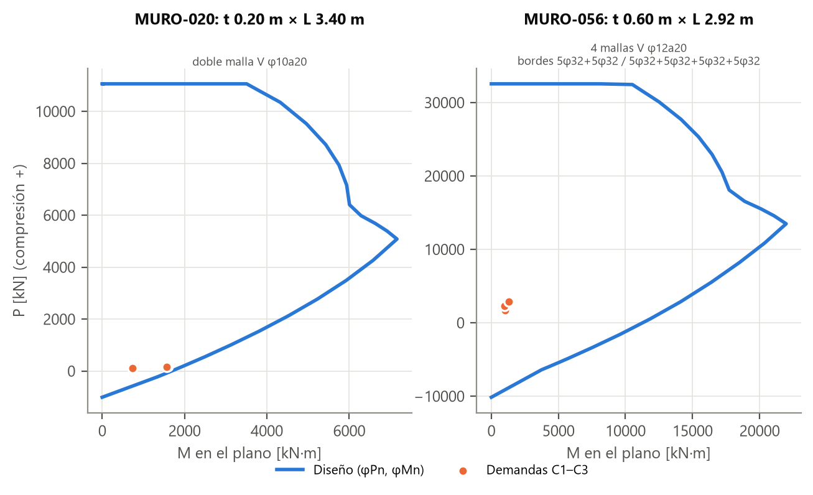

*Figura 6. Curvas de diseño de MURO-020 (el de mayor uso) y MURO-056 (eje A', 4 mallas y bordes 5φ32).*

---

## 12. Demanda-capacidad

**Método:**

- **Vigas con armadura del plano (319):** se verifican sección por sección. En 21 estaciones más las caras de los apoyos, φM_n⁺ con las barras inferiores que pasan por ahí y φM_n⁻ con las superiores, contra M_u(x) (momentos de extremo de OpenSees más la carga repartida). La flexión se verifica **en la cara del apoyo** (ACI §9.4.2), no dentro de la columna. El corte se verifica con los estribos tipo.
- **Vigas sin elevación (79):** igual, con la armadura tipo.
- **Columnas:** P_u y M_u = √(M_y² + M_z²) contra la curva P-M de diseño, más el corte.
- **Muros:** C = M_u / φM_n(P_u) en el plano.
- **Torsión accidental:** cada combinación se evalúa con ±TX y ±TY, y la fila de C1, C2 o C3 de cada elemento guarda la variante más desfavorable, indicada en el panel de Unity.

**Resultados con C1 a C3:**

| Elemento | N | DCR > 1 | DCR máximo |
|---|---|---|---|
| Vigas | 398 | 0 | 0,873 (B3063, V30/80 del edificio 2, armadura tipo) |
| Columnas COL70/70 | 118 | 0 | 0,832 (E1_291, C1 con −TX −TY: P_u = 395 kN, M_u = 479 kN·m, φM_n = 575 kN·m) |
| Muros | 91 | 0 | 0,820 (MURO-020: P_u = 149 kN, M_u = 1 566 kN·m) |

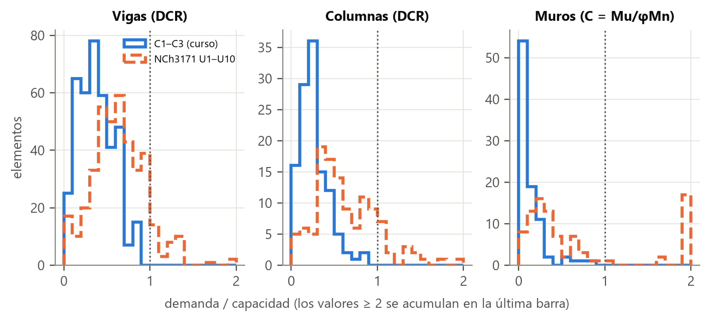

*Figura 7. Distribución de demanda/capacidad con C1 a C3 (azul) y con NCh3171 (naranjo).*

**Ejemplo a mano: viga E1_62** (V60/80, eje 2, x = 25 a 30 m, CIELO_2, elevación 2017_67-302). En la cara del apoyo pasan 12φ25 inferiores en tres capas de 2, 6 y 4 barras:

```text
d   = 800 − (2·62,5 + 6·112,5 + 4·162,5) / 12 = 679,2 mm        A_s = 5 890,5 mm²
a   = 5 890,5 · 420 / (0,85 · 35 · 600) = 138,6 mm             ε_t = 0,0098 > 0,005  →  φ = 0,9
φM_n = 0,9 · 5 890,5 · 420 · (679,2 − 69,3) / 10⁶ = 1 357,9 kN·m
```

El programa da el mismo valor. Con M_u⁺ = 547,7 kN·m (C1 con +TX +TY), la viga queda con DCR = 0,40. Con la armadura tipo (4φ22), esta viga daba 1,32. En total, usar la armadura de los planos y verificar en la cara del apoyo bajó las vigas con DCR > 1 de 34 a 0. Son correcciones de método, no un ajuste para que pasen.

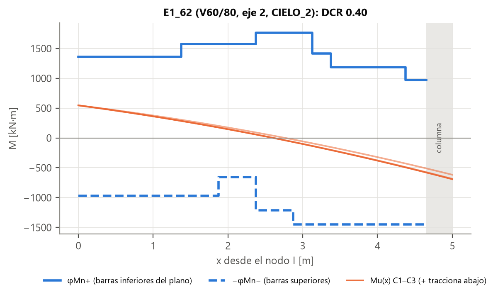

*Figura 8. φM_n⁺ y −φM_n⁻ a lo largo de E1_62 con M_u(x) de C1 a C3 (sin la torsión accidental, que agrega 0,1 %).*

### Sensibilidad: combinaciones de diseño NCh3171

Repetimos la verificación con las 10 combinaciones de diseño de la NCh3171 (`data/combinaciones_nch3171.json`):

- 1,4D;
- 1,2D + 1,6L;
- 1,2D + L ± 1,4E;
- 0,9D ± 1,4E, con E = EX o EY.

| Elemento | DCR > 1 | Máximo | Causa principal |
|---|---|---|---|
| Vigas | **39** | 1,77 | 17 con armadura tipo (sobre todo V30/80 y V60/80 del edificio 2 con 1,2D + 1,6L, hasta 1,40); 20 con armadura del plano entre 1,00 y 1,77 (17 con sismo); 2 artefactos de la verificación |
| Columnas | **16** | 1,72 | 8φ25 supuesta bajo el mínimo ACI, sobre todo columnas del extremo este del edificio 1 (x = 30 y 35) con sismo Y y torsión. Con 10φ25 (1 %) quedan 7 (hasta 1,35); con 16φ25, ninguna. Una columna del subterráneo del edificio 2 (C1003) queda en tracción (1 657 kN) bajo 0,9D − 1,4EY |
| Muros | **20** | — | 13 con tracción mayor que la de toda su armadura con 0,9D ± 1,4EX, en muros partidos en varios paños (como el eje 1'') |

Los dos artefactos son las vigas del voladizo, E1_218 y E1_220. El plano les dibuja solo armadura superior, y un momento positivo de 7 kN·m en la punta las marca con 9,99. En los muros, verificar cada paño por separado hace aparecer el volcamiento del muro completo como tracción en cada paño; lo correcto sería verificar la sección compuesta, lo que no hicimos.

**Conclusión:** con las combinaciones del curso todos los elementos cumplen; con las de diseño, no. La armadura supuesta y la verificación paño por paño explican buena parte, pero no todo: 17 vigas con armadura real quedan sobre 1 con sismo. Corregir el centro de masa y agregar la torsión accidental casi no cambió los resultados con las combinaciones del curso, pero con el sismo completo aumentó la torsión del edificio 1 (de 6 a 16 columnas sobre 1). Por eso el modelo no se presenta como verificación de diseño del edificio real (sección 19).

---

## 13. Unity como pre/postprocesador

Unity (6000.6, proyecto `Proyecto1/edificio_G4`) es la interfaz del laboratorio. No calcula: todo lo estructural lo resuelve Python y OpenSees, y Unity lee el JSON de resultados (`Assets/Resources/estructura_p1l4_unity.json`).

| Rol | Qué hace |
|---|---|
| **Preprocesador** | Edita los parámetros del análisis (Q, Q de cubierta, q_G, sismo NCh433, rigidez fisurada), las combinaciones, la sección de un elemento y su armadura, y quita elementos. *Reanalizar* envía esos cambios a Python (sección 15) |
| **Postprocesador** | Muestra los casos y combinaciones, diagramas N, V y M en ejes locales, la deformada, la superposición en vivo con λ elegidos por el usuario, la curva P-M de cada columna y muro con su punto de demanda, el mapa de utilización y el panel de cada elemento con su armadura y su origen |

La interfaz está en UI Toolkit y tiene cinco pestañas: VISTA, RESULTADOS, CARGAS, MODIFICAR y ANÁLISIS. Corre en el editor, como ejecutable de Windows (`P1G4_Viewer.exe`) y como APK de Android; en el teléfono las funciones que necesitan Python se ocultan.

Los esfuerzos internos a lo largo de cada barra se interpolan entre los extremos de OpenSees, sumando el efecto de la carga repartida del tramo. `test_json_unity_coincide_con_opensees` verifica que lo que muestra Unity sea igual a una corrida directa de OpenSees.

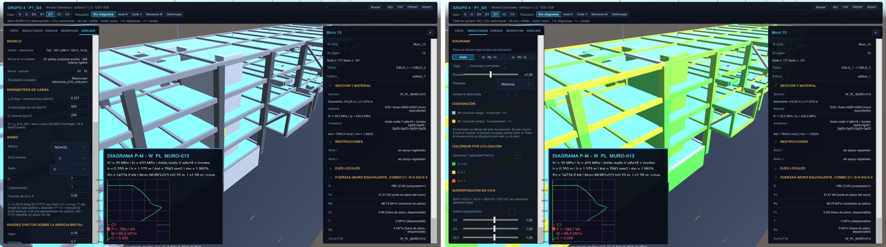

*Figura 9. Pestaña ANÁLISIS con los parámetros del modelo (izquierda) y mapa de utilización P-M de los muros (derecha), con el panel de MURO-013 y su armadura del plano.*

---

## 14. Visualización de apoyos, cargas, ejes y diagramas

| Capa o vista | Qué muestra |
|---|---|
| Apoyos | Los 78 empotramientos y las restricciones de cada nodo en el panel |
| Ejes | Los 40 ejes de grilla leídos de los planos, con sus burbujas, y los ejes locales del elemento seleccionado |
| Diafragmas | Un diafragma por edificio y piso, con su nodo maestro y su centro de masa |
| Cargas | G y Q repartidas en cada viga y la fuerza EX o EY de cada piso, según el caso o la combinación activa |
| Áreas tributarias | Área y carga de losa por piso y edificio (6 136,8 m² en total) |
| Diagramas | N, V y M de cada barra en ejes locales, dibujados del lado traccionado, con escala común y valores máximos |
| Deformada y desplazamientos | La deformada del caso o la combinación activa, con escala ajustable y animación. Cada barra se dibuja con Hermite (desplazamientos y giros de OpenSees en sus nodos) más la flecha de la carga repartida del tramo. El panel del elemento muestra los desplazamientos de sus nodos en mm y, en vigas, la flecha respecto de sus apoyos (L/δ); coincide con OpenSees con la viga partida en su punto medio |
| Superposición en vivo | Sliders λ_G, λ_Q, λ_EX, λ_EY que recombinan los casos base al instante |

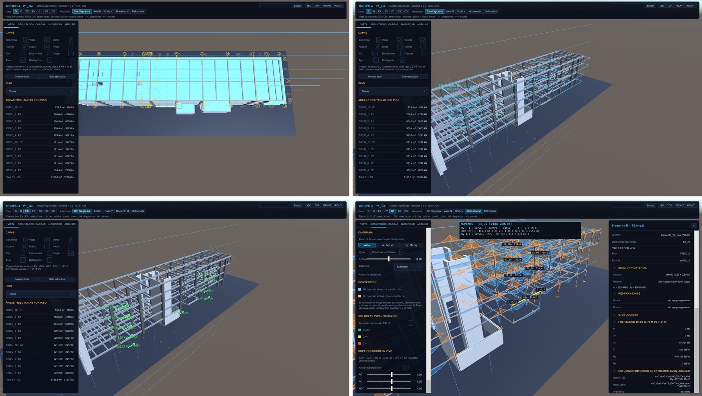

*Figura 10. Ejes de grilla de los planos, diafragmas con su fuerza sísmica, cargas EX por piso y diagrama de momento en C1 con el panel de la viga E1_72.*

---

## 15. Modificación del modelo

Todas las modificaciones siguen la misma cadena: interfaz → archivo de cambios → Python valida → OpenSees reanaliza → JSON nuevo → Unity lo recarga.

| Modificación | Dónde | Efecto |
|---|---|---|
| Parámetros de carga y sismo | ANÁLISIS → *Reanalizar* | Nuevo T*, C, corte basal, esfuerzos y DCR |
| Combinaciones | ANÁLISIS | Se agregan o cambian los λ de cada combinación |
| Sección de un elemento | MODIFICAR → SECCIÓN | Cambia la rigidez en OpenSees (no solo el nombre) |
| Armadura | MODIFICAR → ARMADURA | Regenera la curva P-M y el DCR (Honors H5) |
| Quitar un elemento | MODIFICAR → QUITAR | Reanálisis sin el elemento; su losa sigue cargando a los vecinos; deformada original contra modificada |
| Carga en un elemento | CARGAS | Carga puntual o repartida en −Z, X o Y |

El reanálisis completo tarda unos 11 s. Si una entrada es inválida (por ejemplo Q = −5 kg/m²), el exportador termina con código 2 y Unity muestra el mensaje "ERROR de validación: …"; ningún resultado se calcula con datos fuera de rango.

---

## 16. AR

La app Android (`P1G4_AR.apk`, ARCore) muestra el modelo y sus resultados sobre la estructura real, anclado a un marcador impreso.

- **Marcador:** imagen de 20 × 20 cm generada desde el modelo (`generar_marcador_ar.py`), con la planta del piso y la columna destacada. Va pegado en la cara +X de la columna **E1_243** (eje F-3), hacia la sala del voladizo, con su centro a 1,20 m sobre el CIELO_1.
- **Anclaje:** ARCore detecta la imagen y crea un anchor en su pose; el modelo queda fijo aunque la imagen salga de cuadro, y *RE-ANCLAR* lo recrea.
- **Transformación:** cada nodo pasa al mundo AR con p_AR = T_anchor · s · M · (p − p_ref):
    - p_ref es el punto del modelo en el centro del marcador;
    - M cambia los ejes del modelo a los de la imagen, a partir de la normal de la cara (det = −1, porque OpenSees usa mano derecha y Unity mano izquierda);
    - s es la escala.
- **Modos:** 1:1 sobre la columna, con el sector de la sala del voladizo; maqueta 1:100 sobre una mesa; y sobre el plano impreso, que sirve para verificar la geometría.
- **Resultados:** tocando una barra se ven N, V y M, el desplazamiento, la demanda P-M y la carga tributaria del caso o combinación activa. El teléfono no corre OpenSees: lee el mismo JSON del viewer.

**Precisión.** La app mide en vivo el registro entre la imagen detectada y el anchor. En el Galaxy S24, con el marcador impreso de 20 cm a 0,39 m (figura 11), el desfase fue de 10,6 mm y 2,6°, con un ruido de 2,4 mm. Con esos valores, el error estimado es de unos 5 cm a 1 m del marcador y de 19 cm a 4 m. El error angular domina: cada grado son 1,75 cm por metro, por eso el modo 1:1 es confiable cerca del marcador y conviene volver a anclar lejos de él. El arrastre que vimos al principio venía de los sensores de movimiento del teléfono, que la app recibía a 6 Hz; se corrigió pidiéndolos a 200 Hz.

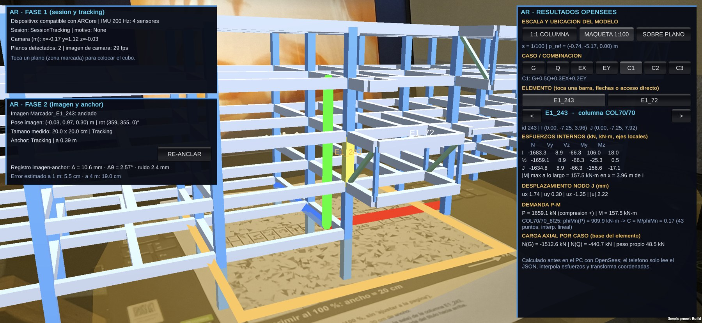

*Figura 11. App de AR en el Galaxy S24 con el marcador impreso de E1_243, en modo maqueta 1:100 y combinación C1. El panel derecho muestra los esfuerzos, el desplazamiento y la demanda P-M de la columna E1_243 (C = 0,17); el izquierdo, el registro marcador-anchor medido en vivo.*

---

## 17. Sidequests implementados

| Sidequest | Qué hace | Verificación |
|---|---|---|
| **Carga móvil** | Una carga P recorre el eje 2 de cualquier piso; Unity combina casos unitarios precalculados con OpenSees, sin reanalizar | Σ R_z = P en 30 posiciones contra análisis directo, error < 10⁻¹⁶ m |
| **Carga en un elemento** | Carga puntual o repartida en cualquier barra y dirección | Validada en vigas, columnas, pilares y arriostres, en −Z, X e Y (semana 5) |
| **Quitar un elemento** | Reanálisis y comparación de la deformada original con la modificada | Equilibrio sin pérdida de carga |
| **Armadura desde los planos** | Lectura automática de las barras de vigas y muros desde las elevaciones DXF | 5 tests en `test_planos.py` y cálculo a mano de E1_62 |
| **Ejes de grilla desde los planos** | 40 ejes principales y secundarios en el viewer | `test_capas_de_la_demo` |
| **Buscador y mapa de utilización** | Buscar un elemento por id o tag y colorear por demanda/capacidad | — |

---

## 18. QA y tests

**Tests automáticos** (`python -m pytest`; 55 tests, unos 75 s; los marcados `lento` corren el exportador completo):

| Archivo | N | Qué verifica |
|---|---|---|
| `test_modelo.py` | 10 | Equilibrio de los 4 casos, corte basal, superposición, unidades, ejes locales, junta y diafragmas |
| `test_cargas.py` | 8 | Áreas tributarias = área de losa, Q por nivel, peso sísmico, C de la NCh433 a mano, centro de masa y torsión accidental |
| `test_capacidad.py` | 9 | Convergencia y corte de la M-φ, puntos ACI de la P-M, Whitney contra fibras, flexión de viga a mano, P-M de muros |
| `test_planos.py` | 5 | Barras de E1_62 y su φM_n, caras de apoyo, mapeo de las elevaciones, mallas y barras de borde |
| `test_unity_json.py` | 9 | Integridad y trazabilidad del JSON, igualdad con OpenSees, panel de áreas tributarias, flecha de vigas como la calcula Unity |
| `test_h4_reanalisis.py` | 12 | Validación de entradas, código de salida 2, reanálisis de Unity = corrida directa |
| `test_h5_armadura.py` | 2 | Curva P-M regenerada y DCR menor con más armadura |

**QA del modelo** (`qa_semana06.py`, evidencia en `Proyecto1/resultados/qa_semana06.json`): equilibrio de G, Q, EX y EY; superposición; T*, C y Σ F = Q0 de la NCh433; convergencia M-φ; P-M de columnas y muros; IDs de Unity únicos y completos.

**Trazabilidad.** Cada JSON de resultados guarda en `corrida` el comando, el commit, las versiones de Python y OpenSeesPy, y el hash de cada archivo de entrada (modelo, parámetros, combinaciones, armaduras). Con eso se sabe con qué datos salió cada número. Los pasos para reproducir todo están en el `README.md`.

---

## 19. Limitaciones

| Limitación | Efecto | Cómo se trata |
|---|---|---|
| Análisis estático NCh433, no modal espectral | Con 12 modos la masa acumulada no llega al 90 % | Es el método que pide el curso; T* queda bien definido |
| Combinaciones del curso (0,3EX y 0,2EY) | No son las de diseño | Sensibilidad con NCh3171 en la sección 12 |
| Columnas con 8φ25 supuesta | Bajo el mínimo ACI de 1 %; los planos no traen cuadro de pilares | Conservador; con NCh3171 quedan 16 columnas sobre 1 |
| 79 vigas y 10 muros sin elevación | Usan armadura tipo supuesta | Marcados como supuestos en el JSON y en Unity |
| Muros verificados paño por paño | Muros partidos en varias columnas anchas no se verifican como sección compuesta | Conservador; explica la tracción de 13 muros con NCh3171 |
| Columnas con el momento resultante contra la curva uniaxial | No es una verificación P-Mx-My | Aproximación usual en sección cuadrada |
| Perfiles metálicos sin pandeo | AISC H1-1 a nivel de sección | Son 21 elementos de la zona I'-J |
| Análisis global lineal | Sin redistribución ni no linealidad geométrica | La no linealidad se estudia en las secciones |
| Suelo y fundación no modelados | Empotramiento en la cota de fundación | — |
| 5 paneles de losa sin apoyo | 8,4 m² (0,14 % del área, 47 kN) sin repartir | Despreciable |
| ETABS del profesor | Lo usamos solo como referencia | No se usa para validar nuestros resultados |
| Precisión de la AR | Error estimado de unos 19 cm a 4 m del marcador | Medida con el marcador impreso sobre una mesa; en la sala conviene volver a anclar para las zonas lejanas |

---

## 20. Uso de IA

Usamos Claude Code (Anthropic) como agente de programación durante todo el proyecto.

**Tareas delegadas.** El agente implementó la mayor parte del código:

- los scripts Python de modelo, cargas, sismo, capacidad y lectura de los DXF;
- el exportador y la validación de entradas;
- los scripts C# de Unity y de la AR;
- los tests;
- los borradores de los informes.

El grupo definió qué hacer y con qué criterio, contrastó los resultados con los planos y la norma, probó en el viewer y en el teléfono, y aceptó o rechazó cada cambio.

**Errores detectados en el trabajo del agente:**

| Error | Cómo se detectó | Corrección |
|---|---|---|
| Fuerzas exportadas en ejes globales y leídas en Unity como locales (el "axial" de las columnas era el corte) | Revisando el diagrama de una columna en el viewer | Exportar `localForce` |
| Momento verificado dentro de la columna (DCR de 9,99) | Mapa de utilización en rojo | Verificar en la cara del apoyo |
| Curvas P-M de muros escaladas desde un muro de referencia | Revisión de capacidad | Curva de diseño por muro con su armadura del plano |
| Sismo aplicado en el centroide de los nodos, 5 m fuera del centro de masa | Revisión del modelo antes de cerrar | Centro de masa con pesos y torsión accidental |
| Proponía el ±5 % de excentricidad accidental del análisis espectral | Revisión contra la NCh433 | ±0,10 · b · Z/H del método estático |
| ETABS tratado como validación | Indicación del grupo | Usarlo solo como referencia |
| Frases del borrador del informe que no se sostenían con los datos | Revisión del informe | Cada cifra se reconstruye desde los resultados |

**Verificaciones.** Nada del agente se aceptó solo porque "corría". Cada resultado tiene un control independiente:

- equilibrio y superposición;
- cálculos a mano: C de la NCh433, φM_n de E1_62, A_st y P0 de muros y columnas;
- comparación con los planos: armadura, muros y ejes;
- 55 tests automáticos (sección 18).

**Contribución real del agente.** Aceleró mucho la implementación y la lectura de los planos DXF; manualmente, leer 1 546 grupos de barras no habría sido viable. También cometió errores de criterio estructural, que encontramos revisando los resultados y no el código. La responsabilidad de las decisiones y de los números es del grupo.

---

## 21. Contribución individual

Cada integrante fue responsable de un módulo, y cada módulo tuvo al menos un revisor distinto de su autor. Gran parte del código lo implementó el agente de IA (sección 20). Aquí describimos lo que cada uno decidió, contrastó con los planos o la norma, probó y aceptó o rechazó.

### Matías Campos — modelo y cargas

- **Contribuciones:**
    - contrastó el modelo OpenSees con las plantas y elevaciones DXF y decidió los 16 ajustes;
    - definió las cargas (q_G, Q de pisos y de cubierta, esta última de 200 kgf/m²) y el sismo NCh433 con el DS61 (zona 3, suelo C, R = 7), en lugar del C fijo de semanas anteriores;
    - decidió usar el modelo ETABS del profesor solo como referencia y no como validación;
    - participó en los tres módulos: definió con Mauricio los criterios de capacidad y con Iván el flujo del viewer, y probó la AR en terreno con su teléfono (Samsung Galaxy S24);
    - coordinó el grupo, eligió la columna E1_243 y la sala del voladizo para la AR, priorizó los Honors H4 y H5, y revisó el informe.
- **Módulos revisados:** los tres. Revisó el equilibrio, la conservación de cargas y las derivas del modelo; la armadura leída de los planos y el ejemplo E1_62 en capacidad; y los paneles del viewer y la AR en el teléfono.
- **Error detectado:** el sismo de cada piso se aplicaba en el **centroide de los nodos** del diafragma y no en el **centro de masa**. En el edificio 1 la diferencia era de 4,6 a 5,0 m, cerca del 10 % del largo de la planta y el doble de la excentricidad accidental de la norma. Se corrigió calculando el centro de masa con los pesos D + 0,25 Q y aplicando la fuerza más el torsor equivalente, y se agregó la torsión accidental de la NCh433 (sección 6). Con C1 a C3 el DCR máximo de columnas pasó de 0,827 a 0,832; con NCh3171, las columnas sobre 1 pasaron de 6 a 16. Evidencia: `test_sismo_en_centro_de_masa` y `test_torsion_accidental_nch433`.
- **Concepto aprendido:** por qué los modos del edificio 2 salen diagonales. Es casi igual de flexible en X que en Y, y sus muros rígidos están en un extremo; cuando las dos flexibilidades son parecidas, cualquier acople por torsión gira los ejes principales hacia 45°. No es un error del modelo, y en este caso no cambia el diseño porque C queda en Cmin.

### Mauricio Lenz — capacidad de hormigón armado

- **Contribuciones:**
    - validó la sección de fibras de la COL70/70 y la convergencia de la malla (sección 9);
    - definió la verificación ACI 318-19: bloque de Whitney, φ según ε_t, flexión en la cara del apoyo;
    - contrastó con los planos la armadura leída de las elevaciones de vigas y muros;
    - interpretó la sensibilidad con las combinaciones NCh3171 (sección 12).
- **Módulo revisado:** Unity y AR, de Iván González.
- **Error detectado:** el panel "Áreas tributarias por piso" del viewer mostraba unos 3 180 m², pero el análisis repartía 6 136,8 m². Sumaba solo las vigas del edificio 1: las vigas del edificio 2 no tenían nombre de piso, y los brazos de muro que reciben losa no se contaban. Se corrigió agrupando por edificio y cota; ahora el panel muestra los 10 pisos y un total igual al del análisis. Evidencia: `test_panel_areas_tributarias`.
- **Concepto aprendido:** la diferencia entre la curva P-M nominal y la de diseño. φ varía entre 0,65 y 0,90 según la deformación del acero extremo, y hay un tope de compresión de 0,80 φ P0. Por eso la cuantía mínima de 1 % en columnas importa: con 8φ25 (0,80 %) la columna supuesta queda bajo el mínimo.

### Iván González — Unity y AR

- **Contribuciones:**
    - diseñó el flujo del viewer como pre y postprocesador: capas, diagramas, superposición en vivo y modificación del modelo;
    - probó el reanálisis desde Unity con su validación de entradas (Honors H4);
    - montó la app de AR y revisó su precisión con el marcador.
- **Módulo revisado:** capacidad de hormigón armado, de Mauricio Lenz.
- **Error detectado:** en el mapa de utilización del viewer aparecían vigas con DCR de 9,99, en rojo. El momento se estaba verificando en el eje de la columna, dentro del apoyo, donde la viga no tiene que resistirlo y donde a veces no pasa ninguna barra. La ACI 318-19 §9.4.2 permite verificar en la cara del apoyo. Se corrigió descartando las estaciones dentro de columnas y muros: junto con la armadura real de los planos, las vigas con DCR > 1 bajaron de 34 a 0. Evidencia: `test_caras_de_apoyo_E1_62`.
- **Concepto aprendido:** la transformación del modelo a la AR, p_AR = T_marcador · s · M · (p − p_ref). La precisión depende del registro del marcador (tamaño impreso, cara y altura de pegado), no del modelo estructural.

## 22. Honors Track

Postulamos a **H4** y **H5**. El núcleo no tiene errores graves en equilibrio, unidades, ejes, cargas, superposición, curvas P-M ni AR básica (secciones 7, 8 y 18), que es la condición del curso para evaluar los Honors.

### H4 — Reanálisis OpenSees en vivo

Unity envía los cambios a Python y OpenSees y recibe los resultados nuevos sin cerrar el viewer.

| Requisito | Cómo lo cumplimos | Evidencia |
|---|---|---|
| Unity → backend → resultados | *Reanalizar* (`AnalysisSession.cs`, `PythonJob.cs`) corre `exportar_resultados_unity.py` con los parámetros, combinaciones, secciones y armaduras editados, y recarga el JSON (unos 11 s) | Demo en vivo |
| Validación | `validacion_entradas.py` revisa rangos (Q, q_G, R, zona, suelo, rigidez, secciones, λ) y la forma de los archivos de cambios antes de analizar | `test_validacion_rechaza` (7 casos) y `test_validacion_combinaciones_y_armaduras` |
| Manejo de errores | Entrada inválida → código 2 y "ERROR de validación: …" en la pestaña ANÁLISIS; no se escribe JSON | `test_exportador_sale_con_codigo_2` |
| Ejecución reproducible | Los mismos argumentos por consola dan el mismo resultado; el JSON guarda comando, commit, versiones y hash de las entradas | `test_trazabilidad_de_la_corrida` |
| Comparación con la corrida directa | El reanálisis con los argumentos de Unity es igual a OpenSees en proceso, también con Q = 300 kg/m² | `test_unity_igual_a_opensees_directo`, `test_escenario_q300_vs_directo` |

### H5 — Cambio de refuerzo con regeneración de la interacción

En MODIFICAR → ARMADURA se cambian las barras de una sección o de un elemento. El reanálisis regenera la curva P-M de diseño con la armadura nueva y recalcula el DCR de todos los elementos afectados. Si el elemento tenía armadura de los planos, el panel avisa que el cambio la reemplaza.

| Requisito | Evidencia |
|---|---|
| La curva se regenera con la armadura nueva | `test_curva_regenerada`: COL70/70 con 12φ25 da A_st, P0 y φP_max calculados a mano, y la misma curva que `capacidad_ha` directo |
| El resultado cambia en el sentido físico correcto | `test_mas_armadura_mas_capacidad_menor_dcr`: con más acero, ninguna columna sube su DCR y la peor baja |
| Aplica a vigas con armadura de los planos | Cambiar la inferior de E1_62 a 6φ22 conserva las superiores del plano y sube el DCR de 0,40 a 0,89 |

Más allá del ejemplo del enunciado, la capacidad usa la armadura real leída de los planos, sección por sección (sección 12), y las curvas de diseño de cada muro con su malla y sus barras de borde (sección 11).

