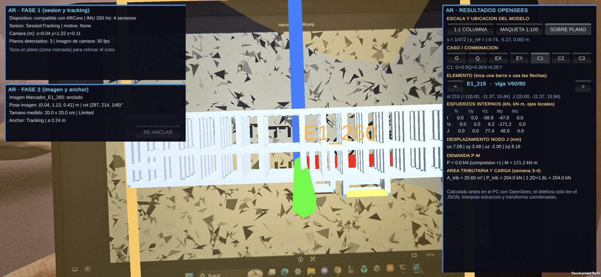
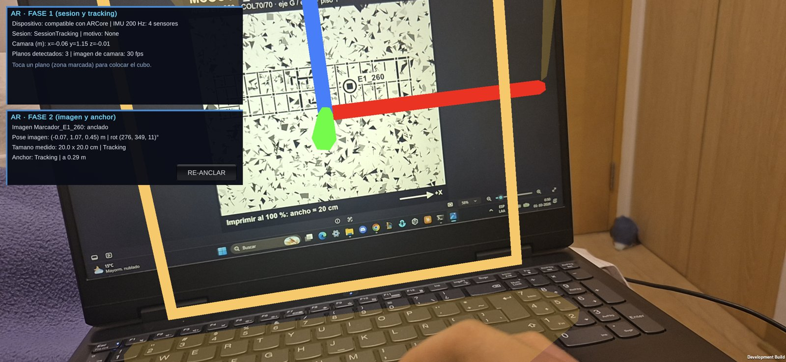
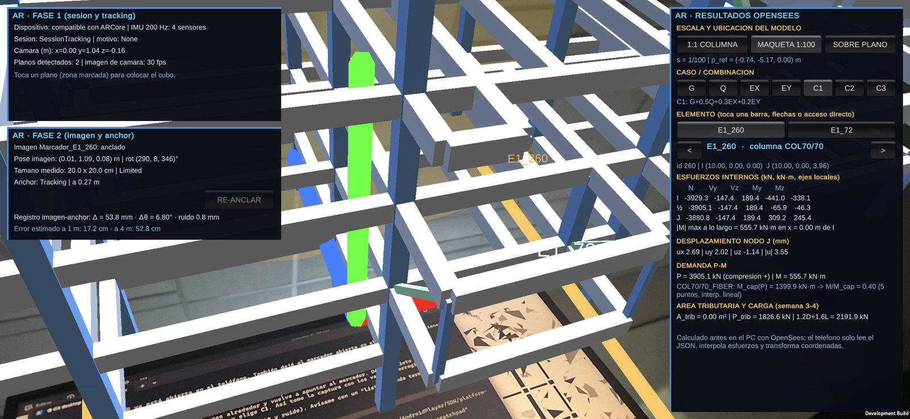
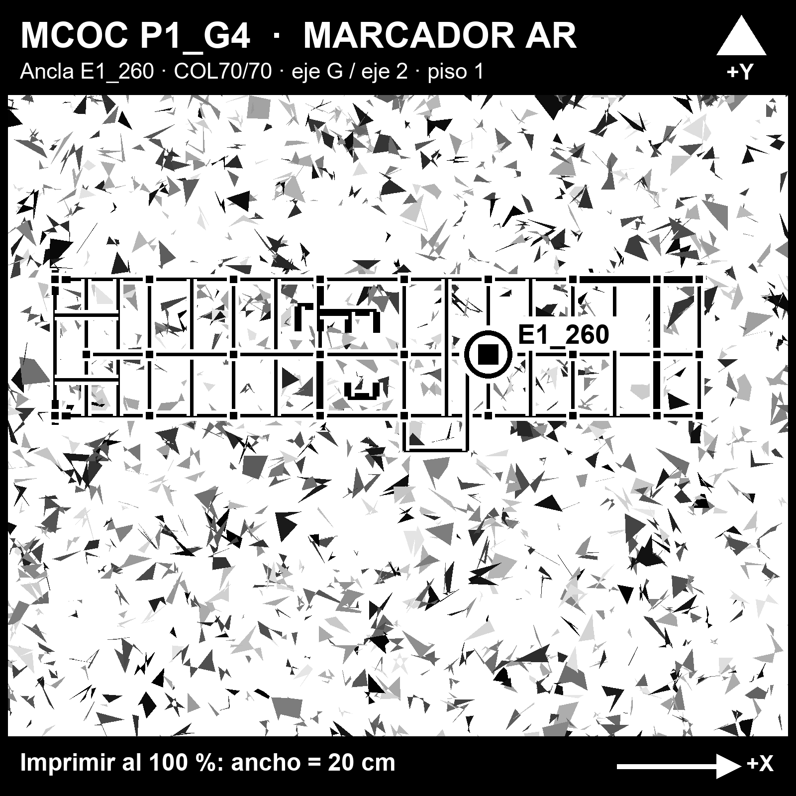

# Semana 6 — Validación AR y cierre técnico

**Proyecto:** modelo estructural del Grupo 4 — edificio 1 (planos 2017_67) y edificio 2 (planos 2024_22), hormigón G35 con refuerzo A630-420H y perfiles A36.
**Herramientas:** OpenSeesPy (análisis, en el PC) · Unity 6000.6.0f1 + AR Foundation 6.6.2 + ARCore XR Plugin 6.6.2 (app AR) · viewer Unity de escritorio.
**Teléfono de prueba:** Samsung Galaxy S24 (Android, ARCore).
**Unidades:** kN, m, kN·m; desplazamientos en mm.

Todas las cifras salen del pipeline reproducible de `Proyecto1/` con el modelo vigente. El QA de la sección 5 se regenera con `python -X utf8 Proyecto1/scripts/qa_semana06.py`, que deja la evidencia en `Proyecto1/resultados/qa_semana06.json`.

| Criterio de la rúbrica | Puntos | Dónde se responde |
|---|---:|---|
| AR reproducible | 5 | §1: flujo, pasos y comandos para reproducir desde cero |
| Transformaciones/registro | 4 | §2: composición de transformaciones; §3: error de registro medido y estimado |
| Trazabilidad estructural | 3 | §4: E1_260 desde OpenSees hasta la pantalla AR, con los mismos números |
| QA global | 5 | §5: tabla con valor, criterio y estado |
| Plan de cierre | 3 | §7: núcleo, polish y Honors |

---

## 1. Flujo AR

### 1.1 Cadena marker → pose → anchor → transform → elemento → resultado

| Paso | Qué es | Quién lo calcula | Código | Cómo se verifica |
|---|---|---|---|---|
| **Marker** | Imagen de referencia de 20 × 20 cm: planta del piso 1 con la columna E1_260 destacada, generada desde el modelo | PC (una vez) | `scripts/generar_marcador_ar.py` → `XRReferenceImageLibrary` con tamaño físico 0,20 m (`ARSetup.CreateReferenceLibrary`) | `arcoreimg eval-img` = **90/100** (Google pide ≥ 75) |
| **Pose** | Posición y rotación del marker en el mundo AR, medidas cuadro a cuadro | Teléfono (ARCore) | `ARTrackedImageManager` → `ARImageAnchor.Update` | El panel muestra pose, tamaño y estado (`Tracking`/`Limited`); ejes dibujados sobre el marker |
| **Anchor** | Punto fijo del mundo real creado en la pose del marker, tras 0,6 s de tracking continuo | Teléfono (ARCore) | `ARAnchorManager.TryAddAnchorAsync(pose)`; botón RE-ANCLAR | El modelo sigue fijo aunque el marker salga de vista; registro marker↔anchor medido en vivo (§3) |
| **Transform** | Nodo OpenSees → coordenadas locales del anchor: `s · M · (p − p_ref)` | Teléfono | `ARStructure.ModelToAnchor`; el contenido es hijo del anchor | Modo SOBRE PLANO: las columnas caen sobre los cuadrados del dibujo (§3.3) |
| **Elemento** | Cada barra dibujada conserva su `ElementData` (id y elementTag de OpenSees) | Teléfono | `ARStructure.MakeBar` + `ARElementTag`; toque → `Physics.RaycastAll` | Etiqueta del elementTag sobre cada barra; panel con id, nodos I/J y coordenadas |
| **Resultado** | N, V, M en I/½/J, desplazamiento, P-M, área tributaria del caso o combo activo | **PC** (OpenSees) → JSON; el teléfono solo lee e interpola | `exportar_resultados_unity.py` → `Resources/estructura_p1l4_unity.json` → `ARResultsPanel` + `UnityData.InternalForcesAt` | Mismos números que OpenSees directo (§4.2) |

**En el teléfono no corre OpenSees.** Corre solo el seguimiento AR (cámara + IMU), la transformación de cada nodo y la lectura del JSON con la interpolación de esfuerzos a lo largo de cada barra (`lerp(−F_I, F_J, t)` más la curvatura de la carga repartida, la misma función que el viewer de escritorio).

### 1.2 Reproducir desde cero

1. **Datos:** `python -X utf8 Proyecto1/scripts/exportar_resultados_unity.py`. Corre OpenSees (G, Q, EX, EY, C1–C3) y escribe el JSON que leen Unity y el AR.
2. **Marker:** `python Proyecto1/scripts/generar_marcador_ar.py`. Genera `Proyecto1/ar/marcador_E1_260_imprimir.pdf` (A4) y la textura para Unity.
3. **Imprimir al 100 %** (sin "ajustar a la página") y medir con regla: el cuadrado con borde negro debe medir **20,0 cm**.
4. **APK:** en Unity, menú `MCOC → AR → Build Android AR (APK)` (o `Unity.exe -batchmode -quit -projectPath Proyecto1/edificio_G4 -buildTarget Android -executeMethod BuildAndroid.BuildAR`). La escena `ARScene` se regenera por código. Salida: `Builds/Android/P1G4_AR.apk` (app "P1_G4 AR", aparte del viewer).
5. **Instalar:** `adb install -r P1G4_AR.apk`, con depuración USB activada.
6. **Usar:**
   - apuntar al marker a 30–50 cm hasta ver "anclado";
   - elegir el modo (1:1 COLUMNA, MAQUETA 1:100 o SOBRE PLANO) y el caso o combo;
   - tocar una barra o usar los accesos directos E1_260 y E1_72.
7. **Ubicación del marker:**
   - modo 1:1: en la cara −Y de la columna E1_260, con el centro a 1,20 m del piso terminado, vertical y con la flecha +X hacia +x del modelo (hacia el eje H);
   - maqueta y sobre plano: sobre una mesa.

Requisitos de build verificados: Android API ≥ 29, ARM64, IL2CPP, solo OpenGL ES 3 sin render multihilo, Activity clásica y `ImuBooster.java` (§6).

---

## 2. Transformación

### 2.1 Sistemas de coordenadas

| Sistema | Ejes | Mano | Origen |
|---|---|---|---|
| **OpenSees** | x, y horizontales; **z arriba** | derecha | z = 0 en el piso 1 |
| **Unity** (viewer) | x, z horizontales; **y arriba** | izquierda | el mismo del modelo |
| **Imagen** (marker) | x derecha (+X impresa), z hacia el borde superior (+Y impresa), y normal hacia el observador | izquierda | centro del marker |
| **Mundo AR** | y arriba (gravedad), x/z arbitrarios | izquierda | donde estaba el teléfono al abrir la app; cambia en cada sesión |

### 2.2 Composición de transformaciones

En coordenadas homogéneas, un nodo del modelo llega al mundo AR por:

```
p_AR = T_mundo←anchor · T_anchor←modelo · p_OpenSees

               | s·M   −s·M·p_ref |
T_anchor←modelo = |                   |        (4 × 4, la arma la app)
               |  0         1     |

T_mundo←anchor = | R_a   t_a |               (pose del anchor, la entrega ARCore)
                 |  0     1  |
```

| Término | Significado | Valor |
|---|---|---|
| `p_ref` | punto del modelo que coincide con el centro del marker (**traslación**) | depende del modo (§2.4) |
| `M` | cambio de ejes modelo → imagen (**rotación** + cambio de mano, det = −1) | §2.3 |
| `s` | **escala** | 1, 1/100 o 1/472 |
| `R_a, t_a` | pose del anchor = pose del marker al anclar (**registro**) | medida en vivo por ARCore |

En Unity, `T_mundo←anchor` se aplica sola, porque el modelo es hijo del `ARAnchor`. El script calcula solo `T_anchor←modelo` (`ARStructure.ModelToAnchor`). El viewer de escritorio usa la misma idea con `T_unity←modelo = P` y `P(dx, dy, dz) = (dx, dz, dy)`.

### 2.3 Matriz M

| Marker | M (filas = x, y, z de la imagen) | (dx, dy, dz) → |
|---|---|---|
| Vertical en la cara −Y de la columna | `[[1,0,0],[0,−1,0],[0,0,1]]` | (dx, −dy, dz) |
| Horizontal sobre la mesa | `[[1,0,0],[0,0,1],[0,1,0]]` | (dx, dz, dy) |

Ambas tienen **det = −1**: pasan de mano derecha (OpenSees) a mano izquierda (Unity/AR). Por eso se aplican a cada nodo como matriz y no como cuaternión.

### 2.4 Escala y traslación por modo

| Modo | s | p_ref (modelo, m) | M | Contenido |
|---|---|---|---|---|
| 1:1 COLUMNA | 1 | (10,00; −0,35; 1,20): cara −Y de E1_260 (COL70/70, eje G, eje 2), centro a 1,20 m | vertical | sector x 5–15, y −7,25–5, pisos 1–2 (25 elementos), más E1_72 |
| MAQUETA 1:100 | 0,01 | (−0,74; −5,17; 0): centro de la planta dibujada | horizontal | edificio completo (81 × 28 m → 81 × 28 cm) |
| SOBRE PLANO | 1/472 | (−0,74; −5,17; 0) | horizontal | edificio a la escala del dibujo (16,94 px/m; 1 600 px = 0,20 m) |

### 2.5 Ejemplo numérico: E1_260 (nodos 8 → 33)

| Nodo | p_OpenSees | p − p_ref | s·M·(p − p_ref) | Lectura |
|---|---|---|---|---|
| 8 (base) | (10; 0; 0) | (0; 0,35; −1,20) | (0; **−0,35**; **−1,20**) | 35 cm detrás de la imagen (eje de la columna 70×70) y 1,20 m abajo: el piso |
| 33 (tope) | (10; 0; 3,96) | (0; 0,35; 2,76) | (0; −0,35; 2,76) | 2,76 m sobre el centro del marker |
| 8, maqueta | (10; 0; 0) | (10,74; 5,17; 0) | (0,107; 0; 0,052) | 10,7 cm a la derecha y 5,2 cm hacia el borde superior, sobre la mesa |

### 2.6 Pose de la imagen frente al anchor

- **La pose de la imagen** cambia cuadro a cuadro y sirve para encontrar el edificio.
- **El anchor** congela esa pose en un punto del mapa de ARCore. El modelo cuelga del anchor, así que se mantiene aunque la imagen quede en `Limited` o fuera de vista.
- **RE-ANCLAR** recrea el anchor con la pose actual de la imagen.
- **La escala real viene del tamaño declarado** (0,20 m). Mostrando el marker en la pantalla del notebook (≈ 11 cm), el marco de 20 cm quedó visiblemente más grande que la imagen. Es la prueba de que la escala sale del tamaño físico configurado.

---

## 3. Precisión

### 3.1 Modelo simple de error

El error de alineamiento de un punto a la distancia `r` del centro del marker se estima así:

```
e(r) ≈ √( e_pos² + (r·δθ)² + (r·δs/s)² + e_col² + (r·δθ_col)² )
```

| Fuente | Símbolo | Valor supuesto | Cómo se controla |
|---|---|---|---|
| Ruido y sesgo de la posición de la imagen (ARCore, a 30–50 cm) | e_pos | 5 mm | medido en vivo (§3.2) |
| Error angular de la pose de la imagen | δθ | 1,0° | medido en vivo (§3.2) |
| Escala de impresión | δs/s | 0,5 % (±1 mm en 200 mm) | medir con regla |
| Colocación del marker en la columna (centro, altura) | e_col | 10 mm | huincha, marca a 1,20 m |
| Verticalidad y giro del marker en la cara | δθ_col | 1,0° | nivel del teléfono |

| Distancia al marker | e estimado | Ejemplo |
|---|---:|---|
| r = 1 m | **≈ 3 cm** | la propia columna E1_260 |
| r = 4 m | **≈ 10 cm** | tope de la columna y vigas vecinas (E1_10, E1_11) |
| r = 8 m | **≈ 20 cm** | extremos del sector y E1_72 (≈ 11 m: ≈ 28 cm) |

Los errores angulares dominan: cada grado equivale a 1,75 cm por metro de distancia. Por eso el modo 1:1 es confiable cerca del marker y conviene RE-ANCLAR o usar un segundo marker para zonas lejanas.

**Modo maqueta 1:100:** el mismo análisis a r ≈ 0,4 m da ≈ 9 mm sobre la mesa, que equivalen a ≈ 0,9 m del modelo (≈ 1 % del largo del edificio). Alcanza para leer y seleccionar elementos, no para medir.

### 3.2 Medición en el teléfono (registro marker ↔ anchor)

La app mide en vivo cuánto se separa la imagen detectada ahora del anchor creado al inicio (`ARImageAnchor.MeasureRegistration`):

- **Δ** = |posición de la imagen expresada en el anchor|, el sesgo de traslación;
- **Δθ** = ángulo entre la rotación de la imagen y la del anchor;
- **ruido** = desviación estándar de la posición en las últimas 120 muestras.

Se muestra en el panel FASE 2 junto con el error estimado a 1 m y a 4 m, y se registra cada 2 s en el log (`[ARQA]`, por `adb logcat`).

Prueba en el Galaxy S24, el 2026-10-02, con 26 lecturas cada 2 s (`Proyecto1/resultados/ar_registro_S24.log`). **Condición:** el marker se mostró en la pantalla del notebook, donde mide unos 11 cm, y no impreso a 20 cm.

| Momento | Δ (mm) | Δθ (°) | Ruido (mm) | e(1 m) ≈ Δ + r·Δθ | e(4 m) |
|---|---:|---:|---:|---:|---:|
| Recién anclado, teléfono quieto (~0,2 m) | 10 | 1,0 | 8,7 | ≈ 3 cm | ≈ 8 cm |
| Después de mover el teléfono y volver, quieto | 54–56 | 6,8–8,8 | 0,4–1,0 | 17 cm | 53 cm |

Lectura:
- **El ruido con el teléfono quieto es muy bajo** (< 1 mm): el anchor y el tracking son estables.
- **El desfase de 55 mm y 8° es sesgo, no ruido.** Con el marker de 11 cm declarado como de 20 cm, ARCore estima mal la profundidad (calcula unos 0,23 m), y la pose sesgada cambia con el ángulo de vista. Por eso al mover el teléfono la imagen "se separa" del anchor.
- **Con el marker bien dimensionado,** el valor recién anclado (10 mm, 1°) coincide con el error supuesto en §3.1.
- **Pendiente:** repetir la medición con el marker impreso a 20 cm y en la columna real (plan núcleo, §7).

### 3.3 Verificación geométrica: modo SOBRE PLANO

En este modo el edificio se dibuja con la misma escala y centro que la planta impresa, con 16,94 px por metro de modelo y 0,20 m = 1 600 px. Si la cadena modelo → marker → anchor está bien, las columnas 3D caen sobre los cuadrados negros del dibujo; cualquier desfase visible es error de registro. Por construcción, el error de diseño de la transformación es cero (mismas fórmulas en `generar_marcador_ar.py` y `ARStructure`).

---

## 4. Resultados

### 4.1 Elemento real: columna E1_260

| Dato | Valor |
|---|---|
| ID OpenSees | **260** (`ops.element('elasticBeamColumn', 260, 8, 33, ...)`) |
| elementTag | **E1_260** |
| Sección · material | COL70/70 · G35, A630-420H |
| Ubicación | eje G (x = 10), eje 2 (y = 0), piso 1: nodo 8 (10; 0; 0) → nodo 33 (10; 0; 3,96) |
| Objeto Unity | `Elemento_260_columna_COL70/70` (`ElementSelectable.data.id = 260`) |
| Barra AR | `ARElementTag.element.id = 260`, etiqueta "E1_260" en naranja |

Resultados de E1_260 (N negativo = compresión; M máx. = resultante en I, centro o J):

| Caso | N (kN) | Vy (kN) | Vz (kN) | M máx. (kN·m) | u tope (mm) ux / uy / uz |
|---|---:|---:|---:|---:|---|
| G | −3 099,2 | 16,4 | 2,2 | 36,1 | −0,10 / −0,14 / −0,90 |
| Q | −1 465,6 | 8,9 | −1,8 | 20,9 | −0,04 / −0,04 / −0,43 |
| EX | 24,7 | 14,4 | 621,4 | 1 488,4 | 9,41 / −0,15 / 0,01 |
| EY | −402,8 | −862,7 | 8,5 | 1 927,4 | −0,07 / 11,11 / −0,12 |
| **C1** | **−3 905,1** | −147,4 | 189,4 | **555,7** | 2,69 / 2,02 / −1,14 |
| C2 | −3 744,0 | 197,7 | 186,0 | 616,1 | 2,72 / −2,42 / −1,09 |
| C3 | −3 919,9 | −156,0 | −183,4 | 575,1 | −2,96 / 2,11 / −1,14 |

P-M en C1: P = 3 905 kN de compresión → M_cap ≈ 1 400 kN·m, interpolando la curva COL70/70 G35 entre "flexión pura" (0; 521) y "última falla dúctil" (4 058; 1 434). **C = M/M_cap = 0,40.**

### 4.2 Evidencia de correspondencia

**a) Numérica: OpenSees directo = JSON = AR.** Se corrió OpenSees de nuevo con C1, se leyó `eleResponse(260, 'localForce')` y se comparó con el registro que leen Unity y el AR:

| Fuente | N_I (kN) | Vy (kN) | Vz (kN) | My_I (kN·m) | Mz_I (kN·m) | ux nodo 33 (mm) |
|---|---:|---:|---:|---:|---:|---:|
| OpenSees (corrida directa) | −3 929,33 | −147,37 | 189,43 | −440,96 | −338,13 | 2,691 |
| JSON `estructura_p1l4_unity.json` (Unity/AR) | −3 929,33 | −147,37 | 189,43 | −440,96 | −338,13 | 2,691 |
| Diferencia máxima (12 componentes) | **0,0** | | | | | |

El panel AR muestra estas mismas fuerzas de extremo. El N del centro (−3 905 kN) difiere del de I (−3 929 kN) en el peso propio de media columna (0,7 × 0,7 × 1,98 × 25 = 24,3 kN).

**b) Identidad: el mismo elemento en cada etapa.** El id 260 y el elementTag E1_260 viajan sin cambio: OpenSees → JSON (`elements[].id/elementTag`, `elementForces[].id`) → Unity (`ElementSelectable.data`) → AR (`ARElementTag.element`). El QA de IDs (§5) comprueba que los 557 elementos tienen id y tag únicos y fuerzas para los 7 casos y combos.

**c) Geométrica.** E1_260 aparece en naranja con su etiqueta en la posición calculada en §2.5; en SOBRE PLANO, sobre el cuadrado destacado de la planta impresa.







Captura del 2026-10-02 en el S24, modo maqueta 1:100, C1. El panel muestra id 260, I (10, 0, 0) → J (10, 0, 3,96), los esfuerzos N −3 929,3 / −3 905,1 / −3 880,8 kN (I / ½ / J), My_I −441,0, Mz_I −338,1 kN·m, |M| máx 555,7 kN·m, ux 2,69 mm y M/M_cap = 0,40. Son los mismos valores de la corrida directa de OpenSees (tabla a).

### 4.3 Segundo elemento: viga E1_72

E1_72 tiene ID 72, sección V60/80 y está en el cielo del piso 2, entre x = 0 y 7,51 en y = −11,37. Los apoyos son pilares PM300×300×20 con arriostres. Tiene acceso directo en el AR y se dibuja también en el modo 1:1. Su revisión motivó la corrección del modelo de cargas (§ anexo A).

| Caso | M en I | ½ L | ¾ L | M en J | V máx. |
|---|---:|---:|---:|---:|---:|
| G (w = 19,06 kN/m) | −65,3 | 97,5 | 78,1 | −8,5 | 79,1 |
| **C3** | **−149,5** | 113,9 | **125,4** | 56,8 | **112,8** |

M en convención de diseño (+ = tracción abajo), en kN·m; V en kN. El momento al centro y el corte se validaron contra OpenSees con la viga partida en dos: −97,47 kN·m y −7,57 kN, idénticos.

---

## 5. QA final estructural

| Prueba | Estado | Valor medido | Criterio |
|---|---|---|---|
| Equilibrio G | ✅ OK | aplicada 59 900,9 kN = ΣRz 59 900,9 kN (error 1,5e‑11 kN) | \|error\| < 1e‑6 kN |
| Equilibrio Q | ✅ OK | aplicada 22 472,6 kN = ΣRz 22 472,6 kN (error 1,1e‑11 kN) | \|error\| < 1e‑6 kN |
| Corte basal EX | ✅ OK | aplicado 14 105,2 kN = ΣRx 14 105,2 kN (error 4e‑11 kN); = 0,20·(D + 0,5Q) por piso | \|error\| < 1e‑6 kN |
| Corte basal EY | ✅ OK | aplicado 14 105,2 kN = ΣRy 14 105,2 kN (error 1e‑10 kN) | \|error\| < 1e‑6 kN |
| Superposición | ✅ OK | C1–C3 explícitas frente a ΣλᵢCasoᵢ: error máximo 2,9e‑11 (desplazamientos, reacciones y fuerzas) | lineal: error ≈ 0 |
| M-φ | ✅ OK | sección de fibras COL70/70 con P = 0: Mmax 660,3 / 656,0 / 659,6 kN·m (mallas 10×10 / 20×20 / 40×40); 20×20 contra 40×40 = 0,55 % | diferencia < 1 % |
| P-M columna | ⚠️ 4 de 119 con C > 1 | peor caso E1_255 en C2: P = 36 kN, M = 767 kN·m, M_cap = 529 → **C = 1,45**; además E1_287, E1_291 y E1_283 (C = 1,02–1,13, piso 4, eje x = 30). Las 115 restantes tienen C ≤ 0,73 | C ≤ 1 |
| P-M muro | ✅ OK (con hipótesis) | 91 muros; peor MURO-031 en C1: P = 344 kN, M = 10 745 kN·m, M_cap = 15 818 → C = 0,68. Demanda estimada (ver §6) | C ≤ 1 |
| IDs Unity | ✅ OK | 557 elementos con id y elementTag únicos; 0 fuerzas faltantes en los 7 casos y combos; 0 nodos inválidos; OpenSees directo = JSON (diferencia 0,0) | 100 % consistente |
| AR | ✅ OK en mesa y pantalla; ⏳ 1:1 en terreno sin probar | sesión estable (IMU 200 Hz), marker 90/100, anchor con ruido < 1 mm, panel de E1_260 = OpenSees (captura §4.2); registro de 10 mm y 1° recién anclado (con el marker en pantalla, 55 mm y 8° tras moverse, §3.2) | flujo completo en el S24 |

Evidencia: `Proyecto1/resultados/qa_semana06.json`, regenerable con `qa_semana06.py` en unos 10 s.

**Lectura de P-M columna:** no es un error del análisis sino un resultado que hay que revisar.
- **E1_255** nace sobre vigas: en el nodo 30 (x = 7,51, y = −7,25, z = 3,96) no hay columna debajo, solo cuatro vigas y el arriostre ARR_02. Por eso tiene axial casi nulo (−11 kN en G) y mucho momento transmitido por las vigas (352 kN·m en G). Hay que confirmar contra los planos si existe una columna en el piso 1 en ese punto.
- **E1_283, E1_287 y E1_291** son columnas del piso 4 en el eje x = 30: poco axial y momento sísmico.
- **Además, la curva es conservadora:** tiene 5 puntos con interpolación lineal, y entre "flexión pura" y "falla dúctil" subestima la capacidad (la curva real es convexa).

---

## 6. Errores conocidos

Se listan todos los conocidos, sin ocultar ninguno.

**Modelo estructural**
1. **Los 91 muros no están en el análisis de OpenSees.** Solo se dibujan; su demanda P-M se estima por área tributaria y reparto del corte de piso. Todos usan una sola curva de referencia (`W_DPRIME_OPENING_TO_3`). En el edificio 2, los muros de los ejes A' y D' entran solo como columnas equivalentes de gravedad. Consecuencia: la rigidez lateral y la distribución del sismo no incluyen los muros.
2. **Columna E1_255 apoyada sobre vigas** (sin columna bajo el nodo 30): C = 1,45. Hay que confirmarlo en los planos.
3. **Tres columnas del piso 4 en el eje x = 30 con C = 1,02–1,13.**
4. **Curva P-M de columnas de 5 puntos** con interpolación lineal (conservadora entre los puntos D y C). Los perfiles metálicos no se verifican por pandeo.
5. **Sismo estático** (C = 0,20 · (D + 0,5Q) por piso, en el nodo maestro), sin análisis modal ni torsión accidental. Los factores 0,3EX / 0,2EY de las combinaciones vienen de la semana 3 y falta confirmarlos con el curso.
6. **El peso propio de las vigas V60/80** (2 295 m, unos 22 400 kN) domina G y la masa sísmica. Hay que confirmar en el plano de vigas que todas sean V60/80.
7. **El peso propio de los muros no entra en G**, salvo el de las columnas equivalentes del edificio 2.

**AR**
8. **El modo 1:1 no se ha probado en el edificio real.** La cara (−Y) y la altura (1,20 m) del marker en E1_260 son supuestas (`ARStructure.MarkerOnColumn`); si cambian, hay que editar `p_ref` y `M`.
9. **La precisión baja con la distancia,** unos 10 cm a 4 m (§3.1). Un solo marker no alcanza para todo el edificio a escala 1:1. Además, el registro medido con el marker en pantalla (55 mm y 8° tras moverse) muestra cuánto empeora con un marker mal dimensionado; falta la medición con el marker impreso.
10. **El IMU de los Samsung** queda a 6 Hz dentro de Unity. Se resuelve con `ImuBooster.java` (listener a 5 ms); es un parche dependiente del dispositivo.
11. **Si el marker se imprime a otro tamaño** que 20 cm, el modelo queda corrido y escalado.
12. **Aviso de Unity** `ClassNotFoundException: AssetPackManager` al iniciar la app. Es inocuo, porque la app no usa asset packs.

**Viewer y herramientas**
13. Quitar elemento, carga en elemento y reanalizar **requieren Python con OpenSees en el PC.** En el teléfono son de solo lectura.
14. Con el modelo modificado, la carga móvil no aplica, porque sus casos unitarios se calcularon con el modelo original.
15. **Direct3D 12 cierra el editor** en el notebook de prueba (Intel + RTX 3060). El proyecto queda en Direct3D 11 y el editor se abre con `-force-d3d11`.
16. Las pestañas Cargas y Quitar elemento del viewer **siguen con paneles IMGUI** (funcionan, con otro estilo).
17. El APK del viewer para el teléfono no se ha regenerado desde la corrección de fuente y de cargas.

---

## 7. Plan final

### Núcleo (obligatorio para la entrega final)
- [ ] Revisar contra planos **E1_255** (¿falta la columna del piso 1 en x = 7,51, y = −7,25?) y las secciones V60/80; reanalizar desde Unity.
- [ ] Confirmar con el curso los factores de las combinaciones y el coeficiente sísmico; reanalizar desde la pestaña ANÁLISIS si cambian.
- [ ] Incorporar los muros al análisis de OpenSees (al menos como columnas anchas equivalentes en los dos edificios) y repetir el QA.
- [ ] Probar el AR 1:1 en la columna E1_260 real: medir el registro (§3.2) y el desfase observado en el tope y en dos vigas vecinas.
- [ ] Regenerar el APK del viewer y el del AR con el modelo final y repetir `qa_semana06.py`.
- [ ] Informe final con QA, trazabilidad y limitaciones al día.

### Polish
- [ ] Pasar Cargas y Quitar elemento a la interfaz nueva (UI Toolkit).
- [ ] Selección múltiple y filtros (tipo, piso, sección); lista de modificaciones con deshacer.
- [ ] Curva P-M de columnas con más puntos (fibras), para no subestimar entre los puntos D y C.
- [ ] Verificación por pandeo de los perfiles metálicos (AISC 360 cap. E/H).
- [ ] Mapa de utilización con leyenda continua en el viewer y en el AR.

### Honors
- [ ] **Análisis modal** en OpenSees (períodos y formas), con los modos animados en el viewer.
- [ ] **Vista de pórtico por eje** en 2D, con diagramas como plano de elevación.
- [ ] **Comparador de escenarios:** original contra modificado, con mapa de colores de la diferencia.
- [ ] **AR con varios markers** (uno por eje o por piso) para mantener la precisión en todo el edificio a 1:1.
- [ ] Ver en AR la deformada amplificada y el camino de carga hasta los apoyos.

---

## Anexo A. Corrección del modelo de cargas (revisión de la viga E1_72)

1. **La gravedad entraba como dos fuerzas nodales,** la mitad de la carga en cada extremo. OpenSees no veía los momentos de empotramiento de las vigas. Ahora G y Q se aplican como **carga repartida** (`eleLoad -beamUniform`, en ejes locales).
2. **No se incluía el peso propio.** Ahora G suma γ = 25 kN/m³ en el hormigón y 78,5 kN/m³ en el acero. En las vigas cuenta solo el alma bajo la losa, b·(h − 0,15), porque la losa ya está en q_G = 6,23 kN/m².

| Indicador | Antes | Ahora |
|---|---:|---:|
| G total (= ΣRz) | 27 878 kN | **59 901 kN** (losa 27 878 + peso propio 32 023) |
| Corte basal EX | 7 823 kN | **14 105 kN** (edificio 1: 8 735 · edificio 2: 5 370) |

Verificación estática de E1_72 en G: momento al centro + promedio de los extremos = 97,5 + (65,3 + 8,5)/2 = 134,4 kN·m = wL²/8. ✓

## Anexo B. Problema del tracking (IMU a 6 Hz)

Dentro de la app de Unity, Android dejaba el giroscopio y el acelerómetro en la tasa mínima del sensor: 160 ms (6,25 Hz). ARCore los pide a 5 ms. Con tan pocas muestras, la pose derivaba sola y no aparecían planos.

El visor AR de Google, en el mismo teléfono, sí recibía 8 ms. `ImuBooster.java` registra un listener vacío a 5 ms, y con eso ARCore recibe unas 250 muestras/s: 0 avisos de IMU, pose estable y planos detectados.

## Anexo C. Archivos de la semana

| Archivo | Rol |
|---|---|
| `Assets/Scripts/Editor/ARSetup.cs` | XR (ARCore), escena AR por código, librería de imágenes (20 cm) |
| `Assets/Scripts/Editor/BuildAndroid.cs` | `BuildAR()`: APK de AR |
| `Assets/Plugins/Android/ImuBooster.java` | IMU a 200 Hz |
| `Assets/Scripts/AR/ARImageAnchor.cs` | marker → pose → anchor; medición del registro (§3.2) |
| `Assets/Scripts/AR/ARStructure.cs` | transformación OpenSees → AR, sector, elementTags |
| `Assets/Scripts/AR/ARResultsPanel.cs` | resultados OpenSees por elemento y combo |
| `Proyecto1/scripts/generar_marcador_ar.py` | marker desde la planta del modelo |
| `Proyecto1/scripts/qa_semana06.py` | QA final estructural (§5) |
| `Proyecto1/resultados/qa_semana06.json` | evidencia del QA |


