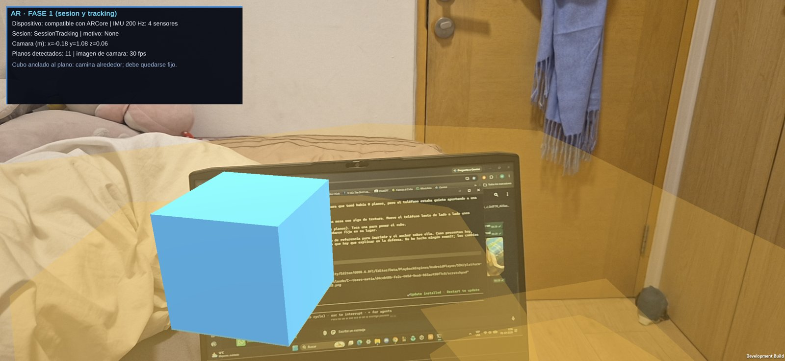

# Semana 6 — AR básica: modelo OpenSees anclado en el mundo real

**Proyecto:** modelo estructural del Grupo 4 — edificio 1 (planos 2017_67) y edificio 2 (planos 2024_22), hormigón G35 con perfiles A36.
**Herramientas:** OpenSeesPy (análisis, en el PC), Unity 6000.6.0f1 + AR Foundation 6.6.2 + ARCore XR Plugin 6.6.2 (app AR, en el teléfono).
**Teléfono de prueba:** Samsung Galaxy S24 (Android, ARCore).
**Unidades:** kN, m, kN·m, mm en desplazamientos.

## 0. Resumen

| Requisito de la entrega | Estado | Dónde |
|---|---|---|
| Iniciar la sesión AR en el teléfono | **OK** | `ARScene` (AR Session + XR Origin), `ARBootstrap` |
| Detectar una imagen de referencia | **OK** | Marcador `Marcador_E1_260` (20 cm), `ARTrackedImageManager` |
| Obtener su pose | **OK** | `ARImageAnchor` (posición + rotación de la imagen en el mundo AR) |
| Crear / usar un anchor | **OK** | `ARAnchorManager.TryAddAnchorAsync(pose)`, botón RE-ANCLAR |
| Transformar coordenadas del modelo | **OK** | `ARStructure.ModelToAnchor` (sección 2) |
| Mostrar un elemento o sector manteniendo su elementTag | **OK** | Sector de la columna `E1_260` (25 elementos, cada barra conserva `id` y `elementTag`) |
| Mostrar al menos un resultado de OpenSees | **OK** | N, V, M (I, ½, J), desplazamiento, P-M, área y carga tributaria, 7 casos/combos |

Escenarios (mismo APK, selector en pantalla):

1. **1:1 COLUMNA** — el marcador se pega en la columna real E1_260 y el sector aparece en tamaño real.
2. **MAQUETA 1:100** — el marcador sobre una mesa y el edificio completo encima (≈ 81 × 28 × 20 m → 81 × 28 × 20 cm).
3. **SOBRE PLANO** — el edificio a la escala del dibujo del marcador (1/472): las columnas caen sobre los cuadrados dibujados, lo que **verifica visualmente la transformación**.

## 1. Flujo: qué se calcula antes y qué corre en el teléfono

```
 PC (antes)                                              Teléfono (en vivo)
 ─────────────────────────────────────────────           ───────────────────────────────────────────
 carga_viva_sismo.py      OpenSees: G, Q, EX, EY,        ARCore: cámara + IMU -> pose del teléfono
                          C1-C3 (localForce, disp)       ARTrackedImageManager: detecta el marcador
 exportar_resultados_unity.py -> JSON (Resources)        ARAnchor en la pose del marcador
 generar_marcador_ar.py   marcador desde la planta       ARStructure: p_OpenSees -> p_AR (sección 2)
 Unity BuildAndroid.BuildAR -> P1G4_AR.apk               ARResultsPanel: lee el JSON, interpola
                                                         esfuerzos internos (UnityData.InternalForcesAt)
```

**En el teléfono NO se ejecuta OpenSees.** Todos los esfuerzos, desplazamientos y curvas P-M vienen del JSON exportado (`Proyecto1/edificio_G4/Assets/Resources/estructura_p1l4_unity.json`, el mismo que usa el viewer de la semana 5). El teléfono solo hace:

- el seguimiento AR (ARCore: odometría visual-inercial, detección de planos e imagen);
- la transformación de coordenadas modelo → anchor;
- la lectura del JSON y la interpolación de esfuerzos internos a lo largo de cada barra: `lerp(−F_I, F_J, t)` + carga del tramo (misma función que el viewer).

## 2. Sistemas de coordenadas y transformación

### 2.1 Los tres sistemas

| Sistema | Ejes | Mano | Origen | Unidad |
|---|---|---|---|---|
| **OpenSees** (modelo) | x, y horizontales; **z hacia arriba** | derecha | z = 0 en el cielo del 1° subterráneo (piso 1) | m |
| **Unity** (viewer semana 5) | x, z horizontales; **y hacia arriba** | izquierda | mismo origen del modelo | m |
| **AR** (mundo de ARCore) | y hacia arriba (gravedad), x/z arbitrarios | izquierda (Unity) | donde estaba el teléfono al iniciar la sesión | m reales |

El viewer usa el cambio `Unity = (x, z, y)`. En AR el origen y la orientación del mundo **no tienen relación con el edificio**: cambian cada vez que se abre la app. Por eso se necesita un punto de referencia físico, que es la imagen.

### 2.2 Marco de la imagen

AR Foundation entrega la pose de la imagen con estos ejes locales:

- **x** = hacia la derecha del marcador (flecha "+X" impresa);
- **z** = hacia el borde superior (flecha "+Y" impresa);
- **y** = normal que sale de la imagen hacia el observador.

### 2.3 Fórmula

```
p_AR = T_anchor · ( s · M · (p_OpenSees − p_ref) )
```

| Término | Qué es | Dónde se obtiene |
|---|---|---|
| `p_OpenSees` | coordenadas del nodo (x, y, z) | JSON del modelo |
| `p_ref` | punto del modelo que coincide con el **centro del marcador** (traslación) | depende del modo (tabla siguiente) |
| `M` | cambio de ejes modelo → marco de la imagen (rotación + cambio de mano) | depende de si el marcador está vertical u horizontal |
| `s` | escala | 1, 1/100 o 1/472 |
| `T_anchor` | pose del ARAnchor en el mundo AR (rotación + traslación) | **la calcula ARCore en vivo** |

En código, el modelo se dibuja como hijo del anchor (`ARImageAnchor.ContentRoot`). Así, Unity aplica `T_anchor` automáticamente y el script solo calcula `s · M · (p − p_ref)` (`ARStructure.ModelToAnchor`).

### 2.4 Matriz M (rotación)

**Marcador en la columna (vertical, cara −Y de E1_260):** x del modelo → derecha del marcador; z del modelo (arriba) → borde superior; −y del modelo → normal hacia afuera de la cara.

```
       | 1   0   0 |                       (dx, dy, dz)  ->  (dx, −dy, dz)
  M =  | 0  −1   0 |   (filas: x, y, z de la imagen)
       | 0   0   1 |
```

**Marcador en la mesa (horizontal):** x → derecha, y del modelo → borde superior (igual que la planta dibujada), z del modelo (arriba) → normal.

```
       | 1   0   0 |                       (dx, dy, dz)  ->  (dx, dz, dy)
  M =  | 0   0   1 |
       | 0   1   0 |
```

Ambas matrices tienen **det = −1**: además de rotar, cambian de un sistema de mano derecha (OpenSees) a uno de mano izquierda (Unity/AR). Es el mismo cambio que hace el viewer `(x, z, y)`. Por eso no se representa como un cuaternión, sino aplicando M a cada nodo.

### 2.5 Escala y traslación por modo

| Modo | s | p_ref (OpenSees, m) | M | Contenido |
|---|---|---|---|---|
| 1:1 COLUMNA | 1 | (10.00, −0.35, 1.20): cara −Y de E1_260 (COL70/70, eje G x = 10, eje 2 y = 0), centro del marcador a 1,20 m del piso | vertical | sector x 5–15, y −7,25–5, z 0–7,92 (pisos 1–2): 20 vigas + 5 columnas, con elementTag |
| MAQUETA 1:100 | 0.01 | (−0.74, −5.17, 0): centro de la planta dibujada | horizontal | edificio completo |
| SOBRE PLANO | 1/472 | (−0.74, −5.17, 0) | horizontal | edificio completo a la escala del dibujo |

La escala 1/472 y el centro de la planta se calculan en el teléfono con las mismas fórmulas del script que dibuja el marcador (`generar_marcador_ar.py`): 16,94 px por metro de modelo y 1 600 px = 0,20 m.

### 2.6 Ejemplo numérico: base y tope de E1_260

Modo **1:1** (nodo 8 = base, nodo 33 = tope):

| Nodo | p_OpenSees | p − p_ref | M·(p − p_ref) en el marco de la imagen |
|---|---|---|---|
| 8 (base) | (10, 0, 0) | (0, 0.35, −1.20) | (0, **−0.35**, **−1.20**): 35 cm detrás de la imagen (eje de la columna) y 1,20 m abajo (el piso) |
| 33 (tope) | (10, 0, 3.96) | (0, 0.35, 2.76) | (0, −0.35, 2.76): 2,76 m sobre el centro del marcador |

Modo **maqueta 1:100**, base de E1_260: p − p_ref = (10.74, 5.17, 0) → s·M·(…) = (0.107, 0, 0.052) m, es decir, 10,7 cm a la derecha y 5,2 cm hacia el borde superior, sobre la mesa.

### 2.7 El anchor

- **Pose de la imagen:** posición + rotación del marcador, medida por ARCore cuadro a cuadro. Sirve para *encontrar* dónde está el edificio.
- **Anchor:** cuando la imagen lleva 0,6 s en seguimiento continuo, se crea un `ARAnchor` en esa pose (`TryAddAnchorAsync`). Desde ahí el modelo cuelga del anchor, no de la imagen. ARCore actualiza el anchor con su mapa del entorno, de modo que el modelo **se queda fijo aunque la imagen salga de la vista** (en la captura de la sección 4 la imagen está en `Limited` y el anchor sigue en `Tracking`).
- **RE-ANCLAR:** si el modelo se desplaza (por ejemplo, se movió la hoja), se recrea el anchor con la pose actual de la imagen.
- El tamaño físico declarado (0,20 m, en la `XRReferenceImageLibrary`) es lo que da la **escala real**. Si el marcador se imprime a otro tamaño, el modelo queda desplazado y mal escalado. Se probó mostrando el marcador en la pantalla del notebook (≈ 11 cm): el marco dibujado de 20 cm queda más grande que la imagen.

## 3. Resultados mostrados en AR

Panel **RESULTADOS OPENSEES** (lado derecho de la pantalla), para el elemento seleccionado (por defecto E1_260; se cambia tocando una barra o con `<` / `>`):

| Bloque | Contenido | Origen |
|---|---|---|
| Escala | modo, s, p_ref | transformación (sección 2) |
| Caso/combo | G, Q, EX, EY, C1, C2, C3 | `data/combinaciones.json` |
| Esfuerzos internos | N, Vy, Vz, My, Mz en I, ½ y J (ejes locales) | `localForce` de OpenSees + `UnityData.InternalForcesAt` |
| Desplazamiento | ux, uy, uz y \|u\| del nodo J (mm) | `nodeDisp` de OpenSees |
| P-M | demanda (P, M máx.) y M_cap(P) de la curva COL70/70 (G35) → M/M_cap | curva P-M exportada |
| Tributaria | A_trib, P_trib, 1.2D+1.6L | semanas 3-4 |

Valores de la columna ancla **E1_260** (COL70/70, piso 1), tal como los muestra el panel (N negativo = compresión):

| Caso | N (kN) | Vy (kN) | Vz (kN) | M máx. (kN·m) | u tope (mm) ux / uy / uz |
|---|---:|---:|---:|---:|---|
| G | −1 704.6 | 1.7 | 1.6 | 8.7 | −0.06 / −0.02 / −0.50 |
| Q | −1 373.2 | 1.3 | 1.3 | 7.0 | −0.04 / −0.02 / −0.40 |
| EX | 14.7 | 8.8 | 381.2 | 914.2 | 5.79 / −0.09 / 0.00 |
| EY | −251.4 | −525.5 | 5.5 | 1 175.5 | −0.04 / 6.79 / −0.07 |
| **C1** | **−2 437.1** | −100.0 | 117.7 | **352.9** | 1.65 / 1.30 / −0.71 |
| C2 | −2 336.6 | 110.1 | 115.5 | 365.8 | 1.67 / −1.42 / −0.68 |
| C3 | −2 445.9 | −105.4 | −111.0 | 362.4 | −1.82 / 1.35 / −0.71 |

P-M de E1_260 en C1: P = 2 437 kN de compresión. Entre los puntos "flexión pura" (0 kN; 521 kN·m) y "última falla dúctil" (4 058 kN; 1 434 kN·m) de la curva COL70/70 G35, M_cap(2 437 kN) ≈ 1 069 kN·m, con lo que **M/M_cap ≈ 0,33**.

## 4. Pruebas en el teléfono (Galaxy S24)

| Fase | Prueba | Resultado |
|---|---|---|
| 1 | Sesión AR, planos, cubo anclado a un plano | SessionTracking, 11 planos, el cubo queda fijo al caminar alrededor |
| 2 | Detección del marcador y anchor | "anclado", anchor en Tracking a 0,29 m; ejes X / normal / Z correctos |
| 3-4 | Modelo sobre el anchor y panel de resultados | Modo SOBRE PLANO (s = 1/472), selección de E1_215, esfuerzos C1 coherentes (momento máximo al centro, negativo en apoyos) |




### 4.1 Problema encontrado: tracking que derivaba (IMU a 6 Hz)

En las primeras pruebas el cubo "se alejaba solo" y no aparecían planos. Diagnóstico con `adb logcat` y `dumpsys sensorservice`:

- ARCore pedía el giroscopio y el acelerómetro a 5 ms (200 Hz), pero dentro de la app de Unity el sistema los dejaba en la **tasa mínima del sensor: 160 ms (6,25 Hz)**. El log de ARCore mostraba "IMU buffer is empty" unas 2 000 veces por minuto.
- Sin IMU, la odometría visual-inercial no puede estimar el movimiento y la pose deriva (la cámara llegó a (−12, −5, 11,7) m estando quieta).
- El visor AR de Google en el mismo teléfono sí recibía 8 ms, así que el teléfono era compatible. Cambiar a la Activity clásica y declarar el permiso `HIGH_SAMPLING_RATE_SENSORS` no cambió la tasa.
- **Solución:** `Assets/Plugins/Android/ImuBooster.java` registra un listener vacío a 5 ms. El sensor físico trabaja a la tasa más rápida que pida algún cliente, por lo que ARCore pasa a recibir unas 250 muestras/s. Resultado: 0 avisos de IMU, pose estable y planos detectados.

Otras correcciones del build AR: OpenGL ES 3 sin render multihilo (evita `GL_INVALID_ENUM` con el fondo de cámara) y una fuente por defecto en móvil (Consolas no existe en Android y dejaba el texto de la interfaz invisible).

## 5. Cómo reproducir

1. **Marcador:** `python Proyecto1/scripts/generar_marcador_ar.py`. Genera `Proyecto1/ar/marcador_E1_260_imprimir.pdf` (A4) y la textura para Unity. Puntaje de `arcoreimg eval-img`: **90/100** (Google recomienda ≥ 75; la primera versión, con fondo gris claro, sacaba 25).
2. **Imprimir al 100 %** (sin "ajustar a la página") y verificar con regla que el cuadrado mida **20 cm**. Pegarlo plano y sin brillo:
   - modo 1:1: en la cara −Y de la columna E1_260, con el centro a 1,20 m del piso y la flecha "+X" hacia +x del modelo;
   - modo maqueta: sobre una mesa.
3. **APK:** en Unity, menú `MCOC / AR / Build Android AR (APK)` (o `-executeMethod BuildAndroid.BuildAR`). La escena `ARScene` se regenera por código (`ARSetup`). Salida: `Proyecto1/edificio_G4/Builds/Android/P1G4_AR.apk` (app "P1_G4 AR", se instala aparte del viewer).
4. Abrir la app, apuntar al marcador a 30–50 cm hasta ver "anclado", elegir el modo y la combinación, y tocar elementos.


## 6. Archivos de la semana

| Archivo | Rol |
|---|---|
| `Assets/Scripts/Editor/ARSetup.cs` | XR (ARCore), escena AR, librería de imágenes (20 cm) |
| `Assets/Scripts/Editor/BuildAndroid.cs` | `BuildAR()`: APK de AR |
| `Assets/Scripts/Editor/ARManifestPatch.cs` | permiso `HIGH_SAMPLING_RATE_SENSORS` en el manifiesto |
| `Assets/Plugins/Android/ImuBooster.java` | IMU a 200 Hz (sección 4.1) |
| `Assets/Scripts/AR/ARBootstrap.cs` | diagnóstico de la sesión, planos, cubo de prueba |
| `Assets/Scripts/AR/ARImageAnchor.cs` | imagen → pose → ARAnchor |
| `Assets/Scripts/AR/ARStructure.cs` | transformación OpenSees → AR, sector E1_260, elementTags |
| `Assets/Scripts/AR/ARResultsPanel.cs` | resultados OpenSees por elemento y combo |
| `Proyecto1/scripts/generar_marcador_ar.py` | marcador desde la planta del modelo |

## 7. Limitaciones y pendientes

- La pose del marcador en la columna real (cara, altura de 1,20 m) es la supuesta en `ARStructure.MarkerOnColumn`. Si en terreno se pega en otra cara o a otra altura, hay que editar ese valor (y M, si cambia la cara).
- La precisión del modo 1:1 depende de la impresión (20 cm exactos) y de pegar el marcador plano. Un error de 1° en la rotación desplaza unos 7 cm el extremo de una viga a 4 m.
- La razón M/M_cap usa la curva P-M de 5 puntos con interpolación lineal (aproximada), igual que el viewer.
- Factores de las combinaciones (0.3EX / 0.2EY) pendientes de confirmar con el curso (vienen de la semana 3).
